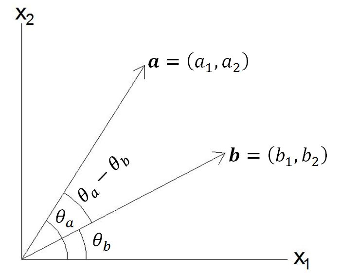

Calculus
===================================================
I would like to start this section with the proof of a very useful formula in calculus, which is the formula for the cosine of an angle between two vectors. Once the cosine of an angle is known, the angle itself can be computed using the Math.acos() function of JavaScript. The Math.acos() function can be executed from the "Web Console" of the Firefox web browser which can be invoked by pressing "F12" or "CTRL+shift+k".

.. _35PercX65:

.. container:: clearer

   .. image :: spacer.png

In the above figure, the cosines and sines of the angles :math:`\theta_a` , :math:`\theta_b` and the angle between the vectors can be expressed as follows:

.. math::
	\cos{\theta_a}=\frac{a_1}{\Vert \mathbf{a} \Vert},\quad \cos{\theta_b}=\frac{b_1}{\Vert \mathbf{b} \Vert},\quad 
	\sin{\theta_a}=\frac{a_2}{\Vert \mathbf{a} \Vert},\quad \sin{\theta_b}=\frac{b_2}{\Vert \mathbf{b} \Vert}

.. math::
	\cos(\theta_a-\theta_b)=\cos(\theta_a)\cos(\theta_b)+\sin(\theta_a)\sin(\theta_b)=\frac{a_1}{\Vert \mathbf{a} \Vert}\frac{b_1}{\Vert \mathbf{b} \Vert}+\frac{a_2}{\Vert \mathbf{a} \Vert}\frac{b_2}{\Vert \mathbf{b} \Vert}=\frac{\langle \mathbf{a} { , } \mathbf{b} \rangle}{\Vert\mathbf{a}\Vert\Vert\mathbf{b}\Vert}

where :math:`\Vert\cdot \Vert` denotes the Euclidean norm or the magnitude of a vector and :math:`\langle { \cdot { , } \cdot } \rangle` denotes the scalar product or inner product of two vectors. 

Vector norm and inner product
---------------------------------
All vectors are  denoted with bold letters. The inner product of two vectors in the Euclidean n-space :math:`\mathbb{R}^n` is defined by :math:`\langle { \mathbf{x} { , } \mathbf{y} } \rangle=\sum_{i=1}^{n}x_iy_i`. Some of the properties of the inner product are as follows [6_]:

.. math::
	\lvert\langle { \mathbf{x} { , } \mathbf{y} } \rangle\rvert\leq \Vert\mathbf{x}\Vert\cdot \Vert\mathbf{y}\Vert

This can be proven using the concept of linear independence. 

Linear independence
~~~~~~~~~~~~~~~~~~~~~~~~~
Let's say we have a set of k vectors :math:`\lbrace \mathbf{v}_1, ... ,\mathbf{v}_k \rbrace` in the Euclidean n-space :math:`\mathbb{R}^n`. These vectors are either linearly dependent or independent. If there exists a set of k coefficients :math:`\lbrace\alpha_1, ... , \alpha_k \rbrace` such that not all of these coefficients are zero and :math:`\alpha_1\mathbf{v}_1 + ... +\alpha_k\mathbf{v}_k=0`, then the vectors are linearly dependent because we could express one of these vectors as a linear combination of the rest of the vectors in the set. As an example suppose that :math:`\alpha_1\neq 0`. Then we could write :math:`\mathbf{v}_1=-(\alpha_2/\alpha_1)\mathbf{v}_2-(\alpha_3/\alpha_1)\mathbf{v}_3- ... -(\alpha_k/\alpha_1)\mathbf{v}_k`. On the other hand if the only way to express the zero vector as a linear combination of these vectors is with :math:`\alpha_i=0\quad\forall i\in\lbrace 1,...,k\rbrace`, then the vectors are linearly independent. If the vectors :math:`\mathbf{x}` and :math:`\mathbf{y}` are linearly dependent, then one of them can be expressed in terms of the other such that :math:`\mathbf{x}=\alpha \mathbf{y}` for some :math:`\alpha \in\mathbb{R}`. Then we obtain:

.. math::
	|\langle \mathbf{x},\mathbf{y} \rangle |=|\langle \alpha \mathbf{y},\mathbf{y} \rangle|=|\alpha\langle \mathbf{y},\mathbf{y}\rangle |=|\alpha|\Vert y\Vert^2=\Vert\alpha \mathbf{y}\Vert\Vert\mathbf{y}\Vert=\Vert\mathbf{x}\Vert\Vert\mathbf{y}\Vert 

On the other hand, if :math:`\mathbf{x}` and :math:`\mathbf{y}` are linearly independent, then :math:`\Vert\mathbf{x}-\alpha\mathbf{y}\Vert\neq 0` for any :math:`\alpha \in\mathbb{R}` and we obtain:

.. math::
	0<\Vert\mathbf{x}-\alpha\mathbf{y}\Vert^2=\sum_{i=1}^{n}(x_i-\alpha y_i)^2=\sum_{i=1}^{n}{x_i}^2+{\alpha}^2{y_i}^2-2\alpha x_iy_i

which is a quadratic equation in form of :math:`a{\alpha}^2+b\alpha + c`. Since this equation is always greater than zero, there are no real values of :math:`\alpha` which would make it equal to zero. As a result the discriminant of the equation (:math:`b^2-4ac`) must be less than zero. Because if it were greater than or equal to zero, then :math:`{(-b \pm\sqrt{b^2-4ac})}/{2a}` would give us some real values that make the quadratic equation equal to zero. Therefore:

.. math::
	\Big(-2\sum_{i=1}^{n}x_iy_i\Big)^2-4\Big(\sum_{i=1}^n{y_i}^2\Big)\Big(\sum_{i=1}^{n}{x_i}^2\Big) <0 

.. math::
	|\langle \mathbf{x},\mathbf{y} \rangle|^2<\Vert\mathbf{y}\Vert^2\Vert\mathbf{x}\Vert^2

This property leads to another one which is called the triangle inequality:

.. math::
	\Vert \mathbf{x}+\mathbf{y}\Vert\leq\Vert\mathbf{x}\Vert + \Vert \mathbf{y}\Vert

To prove this we can proceed as follows:

.. math::
	\Vert\mathbf{x}+\mathbf{y}\Vert^2&=\sum_{i=1}^n(x_i+y_i)^2=\sum_{i=1}^n{x_i}^2+{y_i}^2+2x_iy_i=\Vert\mathbf{x}\Vert^2+\Vert\mathbf{y}\Vert^2+2\langle\mathbf{x},\mathbf{y}\rangle \\
	&\leq \Vert\mathbf{x}\Vert^2+\Vert\mathbf{y}\Vert^2+2\Vert\mathbf{x}\Vert\Vert\mathbf{y}\Vert=(\Vert\mathbf{x}\Vert+\Vert\mathbf{y}\Vert)^2

Now let's turn back to the vectors :math:`\mathbf{a}`, :math:`\mathbf{b}` in :math:`\mathbb{R}^2` and the angle between them. The formula for the cosine of the difference between two angles(or an angle between two vectors) can be derived as follows[1_]:

Let :math:`f(\theta)=\cos(\theta-\beta)+\alpha_1\cos(\theta)+\alpha_2\sin(\theta)` where :math:`f:\mathbb{R}\to\mathbb{R}` and :math:`\beta,\alpha_1, \alpha_2 \in \mathbb{R}` are arbitrary. The first and second derivatives of :math:`f(\theta)` look like:

.. math::
	&f^{'}(\theta)=-\sin(\theta-\beta)-\alpha_1\sin(\theta)+\alpha_2\cos(\theta)\\
	&f^{''}(\theta)=-\cos(\theta-\beta)-\alpha_1\cos(\theta)-\alpha_2\sin(\theta)

from which

.. math::
	f(\theta)+f^{''}(\theta)=0

follows. If we choose :math:`\alpha_1` and :math:`\alpha_2` as

.. math::
	\alpha_1=-\cos(\beta), \alpha_2=-\sin(\beta)

we obtain

.. math::
	f(\theta)=\cos(\theta-\beta)-\cos(\theta)\cos(\beta)-\sin(\theta)\sin(\beta)
.. math::
	f(0)=f^{'}(0)=0

Let's define :math:`g:\mathbb{R}\to\mathbb{R}` as :math:`g(\theta)=(f(\theta))^2+(f^{'}(\theta))^2`. Then

.. math::
	g^{'}(\theta)=2f(\theta)f^{'}(\theta)+2f^{'}(\theta)f^{''}(\theta)=2f^{'}(\theta)\Big(f(\theta)+f^{''}(\theta)\Big)=0 

Since :math:`g^{'}(\theta)=0` for all :math:`\theta\in\mathbb{R}`, :math:`g(\theta)` is a constant function and equal to :math:`g(0)=(f(0))^2+(f^{'}(0))^2=0` for all :math:`\theta\in\mathbb{R}`. Assume that :math:`f(\theta_0)\neq 0` for some :math:`\theta_0 \in\mathbb{R}`. Then :math:`g(\theta_0)=(f(\theta_0))^2+(f^{'}(\theta_0))^2>0`. This contradiction proves that :math:`f(\theta)=0` everywhere on :math:`\mathbb{R}` and therefore :math:`\boxed{\cos(\theta-\beta)=\cos(\theta)\cos(\beta)+\sin(\theta)\sin(\beta)}`.

In the above proof we used the fact that if the derivative of a function is zero everywhere, then this function has a constant value. This can be proven using the mean value theorem as follows: 

.. _mvt:

Mean Value Theorem and Rolle's Theorem
-----------------------------------------

Let :math:`[a,b]\subset\mathbb{R}` with :math:`a<b`. Then :math:`g(\theta)` is differentiable on :math:`[a,b]`. According to the mean value theorem, there exists :math:`\xi \in (a,b)` such that 

.. math::
	g^{'}(\xi)=\frac{g(b)-g(a)}{b-a}=0 \Rightarrow g(b)=g(a), \forall a,b \in \mathbb{R}, \quad\therefore \boxed{g(\theta)=const}

In order to prove the mean value theorem, it is possible to define another function :math:`G:\mathbb{R}\to\mathbb{R}` as :math:`G(\theta)=g(\theta)+\alpha\theta` for some :math:`\alpha\in\mathbb{R}`. Then for any interval :math:`[a,b]\subset\mathbb{R}`, :math:`G(\theta)` is differentiable on :math:`[a,b]`. Also, :math:`\alpha` can be chosen in such a way that :math:`G(a)=G(b)`. Since :math:`G(a)=g(a)+\alpha a` and :math:`G(b)=g(b)+\alpha b`, Choosing :math:`\alpha=(g(b)-g(a))/(a-b)` would imply that :math:`G(a)=G(b)`. Since :math:`G(\theta)` is differentiable on :math:`[a,b]`, according to Rolle's theorem, there exists :math:`\xi \in (a,b)` such that

.. math::
	G^{'}(\xi)=0=g^{'}(\xi)+\frac{g(b)-g(a)}{a-b}\Rightarrow \boxed{g^{'}(\xi)=\displaystyle\frac{g(b)-g(a)}{b-a}}

Once it is known that :math:`G(a)=G(b)`, there are only three possibilities for the behaviour of :math:`G(\theta)` on some point :math:`\theta_0 \in (a,b)`. The first possibility is that :math:`G(a)=G(\theta_0)=G(b)`. If this is true for any :math:`\theta_0 \in (a,b)` then :math:`G(\theta)` is constant on :math:`[a,b]` and its derivative is zero at any :math:`\xi\in(a,b)` because of the definition of derivative as follows:

.. math::
	G^{'}(\xi)=\underset{\theta \to \xi}{\lim}\frac{G(\theta)-G(\xi)}{\theta -\xi}=\underset{\theta \to \xi}{\lim}\frac{0}{\theta -\xi}=0

The second possibility is that for some :math:`\theta_0 \in (a,b)`, :math:`G(\theta_0)>G(a)=G(b)`. In this case the Weierstrass' maximum-minimum theorem guarantees the existence of some :math:`\theta_{max}\in (a,b)` such that :math:`G(\theta_{max})\geq G(\theta_0)>G(a)=G(b)` and for any :math:`\theta \in (a,b)`, :math:`G(\theta)\leq G(\theta_{max})`. We also know that :math:`G^{'}(\theta_{max})` exits and is equal to the right-hand and left-hand derivatives of :math:`G` at :math:`\theta_{max}`.

.. math::
	0\leq\underset{\theta \to {\theta _{max}} ^{-}}{\lim}\frac{G(\theta)-G(\theta _{max})}{\theta -\theta _{max}}=G^{'}(\theta _{max})=\underset{\theta \to {\theta _{max}}^{+}}{\lim}\frac{G(\theta)-G(\theta _{max})}{\theta -\theta _{max}}\leq 0

From the above inequalities it is clear that :math:`\boxed{G^{'}(\theta _{max})=0}`. This completes the proof of Rolle`s theorem since the only remaining possibility is that for some :math:`\theta_0 \in (a,b)`, :math:`G(\theta_0)<G(a)=G(b)` and the proof of this case is identical to the previous case.  

Taylor's theorem
------------------------

A generalization of the **mean value theorem** to n times differentiable functions is **Taylor's theorem**. According to Taylor's theorem, if :math:`f^{(n-1)}(x)` exists on [a,b] and :math:`f^n(x)` exists on (a,b), then there exists :math:`\xi \in (a,b)` such that  

.. math::
	f(b)=\sum_{k=0}^{n-1}\frac{f^{(k)}(a)}{k!}(b-a)^k + \frac{f^{n}(\xi)}{n!}(b-a)^n

In order to prove this, we define the following function :math:`\phi(x)` [2_] :

.. math::
	\phi(x)=\sum_{k=0}^{n-1}\frac{f^{(k)}(x)}{k!}(b-x)^k + M(b-x)^n

Clearly :math:`\phi` is continuous on [a,b] and differentiable on (a,b). Therefore if we choose a value for M such that :math:`\phi(a)=\phi(b)=f(b)`, then from Rolle's theorem [mvt_] it would follow that there exists :math:`\xi\in (a,b)` such that :math:`\phi'(\xi)=0`.

.. math::
	\phi'(x)&=f'(x)+\sum_{k=1}^{n-1}\frac{f^{(k+1)}(x)}{k!}(b-x)^k - \frac{f^{(k)}(x)}{k!}k(b-x)^{(k-1)} - Mn(b-x)^{(n-1)} \\
	&=f'(x)+\sum_{k=2}^{n}\frac{f^{(k)}(x)}{(k-1)!}(b-x)^{k-1}-\sum_{k=1}^{n-1}\frac{f^{(k)}(x)}{(k-1)!}(b-x)^{k-1}-Mn(b-x)^{n-1}\\
	&=f'(x)-f'(x)+\frac{f^{(n)}(x)}{(n-1)!}(b-x)^{n-1}-Mn(b-x)^{n-1}\\

.. math::
	\phi'(\xi)=0\Rightarrow \frac{f^{(n)}(\xi)}{(n-1)!}(b-\xi)^{n-1}=Mn(b-\xi)^{n-1}\Rightarrow M=\frac{f^{(n)}(\xi)}{n!}

Inserting the above found M into the expression :math:`\phi(a)=\phi(b)` completes the proof of Taylor's theorem.

Taylor's theorem can also be expressed in **integral form** using the fundamental theorem of calculus which says that if a function :math:`f(x)` is differentiable on :math:`[a,b]` and :math:`\int_a^b f'(x)dx` exists, then :math:`f(b)-f(a)=\int_a^b f'(x)dx`. This expression can be reformulated as 

.. math::
	f(b)=\frac{1}{0!}f(a)(b-a)^0+\frac{1}{0!}\int_a^bf'(x)dx=p_0+r_0

Using `integration by parts`_, the :math:`r_0` part of the above equation can be expanded as follows:

.. math::
	r_0&=-\frac{1}{1!}\int_a^bf'(x)d(b-x)\\
	   &u=f'(x), du=f''(x)dx,\quad dv=d(b-x), v=b-x \\
	   &=-\frac{1}{1!}\Big[f'(x)(b-x)\Big|_a^b-\int_a^bf''(x)(b-x)dx\Big]\\
	   &=-\frac{1}{1!}\Big[-f'(a)(b-a)-\int_a^bf''(x)(b-x)dx\Big]\\
	   &=\frac{1}{1!}f'(a)(b-a)^1+\frac{1}{1!}\int_a^bf''(x)(b-x)dx

which gives us

.. math::
	p_1=\frac{1}{0!}f^{(0)}(a)(b-a)^0+\frac{1}{1!}f^{(1)}(a)(b-a)^1,\quad r_1=\frac{1}{1!}\int_a^bf^{(2)}(x)(b-x)^1dx

Continuing this way, if :math:`f^{(n+1)}(x)` is continuous on :math:`[a,b]`, then we would obtain

.. math::
	p_n=\sum_{k=0}^{n}\frac{f^{(k)}(a)}{k!}(b-a)^k,\quad r_n=\frac{1}{n!}\int_a^bf^{(n+1)}(x)(b-x)^ndx

In order to show this inductively, we can expand :math:`r_n` as follows

.. math::
	r_n&=-\frac{1}{(n+1)!}\int_a^bf^{(n+1)}(x)d(b-x)^{(n+1)}\\
	   &=-\frac{1}{(n+1)!}\Big[f^{(n+1)}(x)(b-x)^{(n+1)}\Big|_a^b-\int_a^bf^{(n+2)}(x)(b-x)^{(n+1)}dx\Big]\\
	   &=\frac{1}{(n+1)!}f^{(n+1)}(a)(b-a)^{(n+1)}+\frac{1}{(n+1)!}\int_a^bf^{(n+2)}(x)(b-x)^{(n+1)}dx

which gives us

.. math::
	p_{n+1}=\sum_{k=0}^{n+1}\frac{f^{(k)}(a)}{k!}(b-a)^k,\quad r_{n+1}=\frac{1}{(n+1)!}\int_a^bf^{(n+2)}(x)(b-x)^{(n+1)}dx

Therefore, if :math:`f^{(n)}(x)` is continuous on :math:`[a,b]`, then **the integral form of Taylor's theorem** is

.. math::
	f(b)=\sum_{k=0}^{n-1}\frac{f^{(k)}(a)}{k!}(b-a)^k+\frac{1}{(n-1)!}\int_a^bf^{(n)}(a)(b-a)^{(n-1)}dx

Integration by Parts
--------------------------------
We used this integration rule while deriving the integral form of `Taylor's theorem`_. The rule is based on `the fundamental theorem of calculus`_ which says that if :math:`f,g` are differentiable functions and :math:`f',g'` are integrable on :math:`[a,b]` then :math:`\int_a^b(f(x)g(x))'dx=f(x)g(x)|_a^b`.

Using `the product rule`_ for differentiation we obtain:

.. math::
	&\int_a^b(f(x)g(x))'dx=\int_a^b\Big[f'(x)g(x)+f(x)g'(x)\Big]dx=f(x)g(x)|_a^b\\
	&\Rightarrow \int_a^bf(x)g'(x)dx=f(x)g(x)|_a^b-\int_a^bg(x)f'(x)dx

If we let :math:`f(x)=u`, :math:`g(x)=v`, this rule can also be expressed as :math:`\int_a^b udv=uv|_a^b-\int_a^bvdu`.

Power Series
------------------

Series in the form of the Taylor expansion of a function :math:`f:[a,b]\to\mathbb{R}` at :math:`b` about :math:`a` are called power series. Furthermore, for every power series :math:`\sum_{k=n}^\infty c_k(x-a)^k` there is a certain set of values such that if :math:`|x|` is in that set then the series absolutely converges and if it is not then the series diverges. This set is defined by the concept of `radius of convergence`_. Before proving that every power series has a radius of convergence, first let's clarify the concept of absolute convergence and show that absolutely convergent series are a subset of convergent series.

A series in the form :math:`\sum_{k=n_0}^\infty a_k` is absolutely convergent if the series :math:`\sum_{k=n_0}^\infty |a_k|` is convergent. To show this we use a property of the absolute value operator which states that if :math:`x,c\in\mathbb{R}` and :math:`c\geq 0` then :math:`|x|\leq c` if and only if :math:`-c\leq x\leq c`. Using this we obtain :math:`-|a_k|\leq a_k \leq |a_k|` and :math:`0\leq a_k+|a_k|\leq 2|a_k|`. According to the `direct comparison test`_ for the convergence of series, if :math:`\sum_{k=n_0}^\infty |a_k|` converges then :math:`\sum_{k=n_0}^\infty 2|a_k|` converges and :math:`\sum_{k=n_0}^\infty a_k+|a_k|` converges. We know that :math:`\sum_{k=n_0}^\infty a_k=\sum_{k=n_0}^\infty a_k+|a_k|-|a_k|=\sum_{k=n_0}^\infty a_k+|a_k|-\sum_{k=n_0}^\infty |a_k|`. This means that :math:`\sum_{k=n_0}^\infty a_k` is the sum of two convergent series and therefore is itself convergent.

Direct Comparison Test
~~~~~~~~~~~~~~~~~~~~~~~~~~~~~~~
This test is used in order to determine the convergence behaviour of a series :math:`\sum_{k=n_0}^\infty |a_k|` based on the behaviour of another series :math:`\sum_{k=n_0}^\infty |b_k|`. If there exists :math:`N\in \mathbb{N}` such that :math:`\forall k\geq N`, :math:`0\leq a_k\leq b_k`, then :math:`\sum_{k=n_0}^\infty |b_k|` is convergent :math:`\Rightarrow` :math:`\sum_{k=n_0}^\infty |a_k|` is convergent and if :math:`\sum_{k=n_0}^\infty |a_k|` is divergent :math:`\Rightarrow`:math:`\sum_{k=n_0}^\infty |b_k|` is divergent. Let :math:`M_a=\sum_{k=n_0}^N a_k`, :math:`M_b=\sum_{k=n_0}^N b_k`. Then :math:`\sum_{k=n_0}^\infty a_k=M_a+\sum_{k=N+1}^\infty a_k` and :math:`\sum_{k=n_0}^\infty b_k=M_b+\sum_{k=N+1}^\infty b_k`. Let :math:`\forall n>N`,
:math:`S_n=\sum_{k=N+1}^n a_k` and :math:`T_n=\sum_{k=N+1}^n b_k`. If :math:`\sum_{k=n_0}^\infty b_k` is a convergent series, then :math:`\lbrace T_n \rbrace` must be a convergent and therefore bounded sequence. As a result :math:`\lbrace S_n \rbrace` is bounded. Since :math:`a_k` is non-negative for :math:`k\geq N`, :math:`\lbrace S_n \rbrace` is also a monotonely increasing sequence. Therefore :math:`\lbrace S_n \rbrace` is convergent and :math:`\sum_{k=n_0}^\infty a_k=M_a+\lim_{n\to\infty}S_n`.

Assume that :math:`\sum_{k=n_0}^\infty a_k` is divergent but :math:`\sum_{k=n_0}^\infty b_k` is convergent. Then :math:`\lbrace T_n\rbrace` must be convergent and bounded which implies the boundedness and convergence of :math:`\lbrace S_n \rbrace` and :math:`\sum_{k=n_0}^\infty a_k`. This contradiction proves the divergence of :math:`\sum_{k=n_0}^\infty b_k`.   

Every convergent sequence is bounded
~~~~~~~~~~~~~~~~~~~~~~~~~~~~~~~~~~~~~~~~
While proving why direct comparison test works we used the fact that convergent sequences must be bounded. Let :math:`a_n\to L`. :math:`\exists N\in\mathbb{N}:n\geq N \Rightarrow |a_n-L|<1\Rightarrow|a_n|<1+|L|` where we are using another property of the absolute value operator which is as follows: :math:`\Big||x|-|y|\Big|\leq |x-y|,\forall x,y\in\mathbb{R}`. Let :math:`M=\max\lbrace|a_1|, |a_2|, ... , |a_{N-1}|,1+|L|\rbrace`. Then :math:`\forall n,|a_n|\leq M` and :math:`\lbrace a_n\rbrace` is bounded.

Limit Comparison Test 
~~~~~~~~~~~~~~~~~~~~~~~~~~~~~~~~
[4_]Let :math:`\frac{a_n}{b_n}=L`. Also let :math:`0\leq a_n\leq b_n` for :math:`n` greater than or equal to some :math:`N\in\mathbb{N}`. Then, if :math:`0<L<\infty`, then :math:`\sum_{n=0}^\infty a_n` is convergent if and only if :math:`\sum_{n=0}^\infty a_n` is convergent.

Ratio Test 
~~~~~~~~~~~~~~~~~~~~
[4_]Let :math:`a_n>0` for all :math:`n` and :math:`\lim_{n\to\infty}\frac{a_{n+1}}{a_n}=\rho`. If :math:`\rho<1` then the series :math:`\sum_{n=n_0}^\infty a_n` converges, if :math:`\rho>1` then the series diverges and if :math:`\rho=1` then the test is inconclusive. First, let
s investigate the case when :math:`\rho<1`. Let :math:`\rho<r<1`. Then there exists :math:`N\in\mathbb{}N` such that if :math:`n\geq N` then :math:`\frac{a_{n+1}}{a_n}-\rho <r-\rho`.

Root Test 
~~~~~~~~~~~~~~~~~~~
[4_]Let :math:`\sqrt[n]{a_n}\to \rho`. If :math:`\rho<1` then :math:`\sum_{n=0}^\infty a_n` is convergent and if :math:`\rho>1` then th series is divergent. In case of :math:`\rho=1` the test is inconclusive.

Dirichlet Test 
~~~~~~~~~~~~~~~~~~~~~~
[2_] Let :math:`a_k\to 0` and :math:`S_n=\sum_{k=0}^\infty b_k` is a bounded sequence such that for every :math:`n`, :math:`|S_n|\leq B`. Furthermore the sequence :math:`\lbrace a_k\rbrace` is of bounded variation which means that :math:`\lim_{k=1}^\infty |a_{k+1}-a_k|` is convergent. Then :math:`\sum_{k=1}^\infty a_kb_k` is convergent.

Let :math:`\varepsilon>0`. There exists :math:`N` such that whenever :math:`n,m\geq N`, :math:`\sum_n^m|a_{k+1}-a_k|<\frac{\varepsilon}{3B}` by the Cauchy convergence criterion. Also whenever :math:`k\geq N`, :math:`|a_k|<\frac{\varepsilon}{3B}`.

Let :math:`n,m \geq N`. Using `Abel's lemma`_ :

.. math::
	\Big|\sum_{k=n}^m a_kb_k \Big|&=\Big|\sum_{k=n}^ma_k(S_k-S_{k-1})\Big|\\
	   &=\Big| a_{m+1}S_m-a_nS_{n-1}-\sum_{k=n}^m (a_{k+1}-a_k)S_k\Big|\\
	   &\leq\Big| a_{m+1}S_m\Big|+\Big|a_nS_{n-1}\Big|+\Big|\sum_{k=n}^m (a_{k+1}-a_k)S_k\Big|\\
	   &\leq\Big| a_{m+1}\Big|\Big|S_m\Big|+\Big|a_n\Big|\Big|S_{n-1}\Big|+\Big|S_k\Big|\Big|\sum_{k=n}^m (a_{k+1}-a_k)\Big|\\
	   &<\frac{\varepsilon}{3B}B+\frac{\varepsilon}{3B}B+\frac{\varepsilon}{3B}B=\varepsilon

Therefore :math:`\sum_{k=0}^\infty a_kb_k` is convergent according to the Cauchy convergence criterion.

Cauchy convergence criterion
~~~~~~~~~~~~~~~~~~~~~~~~~~~~~~~~~~
[1_] This criterion says that a sequence is convergent if and only if it is a Cauchy sequence. A sequence is called Cauchy sequence, if for every :math:`\varepsilon`, there exists :math:`N\in\mathbb{N}` such that whenever :math:`n,m\geq N`, :math:`|a_n-a_m|<\varepsilon`.

If :math:`a_n\to L` and :math:`\varepsilon>0`. There exists :math:`N\in\mathbb{N}` such that :math:`n,m\geq N\Rightarrow |a_n-L|<\varepsilon/2` and :math:`|a_m-L|<\varepsilon/2`. Therefore :math:`|a_n-a_m|=|a_n-L+L-a_m|\leq |a_n-L|+|a_m-L|<\varepsilon/2+\varepsilon/2=\varepsilon`. 

Conversely, if :math:`\lbrace a_n\rbrace` is a Cauchy sequence, then first of all it is a bounded sequence. We know that there exists :math:`N\in\mathbb{N}` such that :math:`n,m\geq N\Rightarrow|a_n-a_m|<1\Rightarrow |a_n|<1+|a_N|`. Let :math:`M=\max\lbrace|a_1|,|a_2|, ... ,|a_{N-1}|, 1+|a_N|\rbrace`. Then :math:`\lbrace a_n \rbrace` is bounded by :math:`M`. Since :math:`\lbrace a_n \rbrace` is bounded, it has a convergent subsequence :math:`a_{n_k}\to c`. Let :math:`\varepsilon >0`. For some :math:`N`, :math:`|a_n-a_m|` is always less than :math:`\varepsilon/2` if :math:`n,m\geq N`. Also there exists :math:`K>N` such that if :math:`k\geq K`, then :math:`|a_{n_k}-c|<\varepsilon/2`. Let :math:`n\geq N` and :math:`k\geq K`. Considering that :math:`n_k\geq k`, we obtain :math:`|a_n-c|=|a_n-a_{n_k}+a_{n_k}-c|\leq|a_n-a_{n_k}|+|a_{n_k}-c|<\varepsilon/2+\varepsilon/2=\varepsilon`. This proves that every Cauchy sequence is a convergent sequence.   

Abel's Lemma 
~~~~~~~~~~~~~~~~~~~~~
[2_]This lemma states that :math:`\sum_n^ma_k(b_{k+1}-b_k)=a_{m+1}b_{m+1}-a_nb_n-\sum_n^m(a_{k+1}-a_k)b_{k+1}`. This can be proven as follows:

.. math::
	\sum_n^m a_k (b _{k+1}-b_k)&=\sum_n^ma_k b _{k+1}-\sum_n^m a_k b_k \\
	&=\sum_n^ma_k b _{k+1}-\sum _{n+1}^{m+1} a_k b_k +a _{m+1}b _{m+1}-a_nb_n \\
	&=\sum_n^m \Big[a _k b _{k+1}-a _{k+1}b _{k+1}\Big]+a _{m+1}b _{m+1}-a_nb_n \\
	&=\sum_n^m b _{k+1}\Big[ a_k-a _{k+1} \Big]+  a _{m+1}b _{m+1}-a_nb_n \\
	&=a _{m+1}b _{m+1}-a_nb_n-\sum_n^m(a _{k+1}-a_k)b _{k+1}

Radius of convergence 
~~~~~~~~~~~~~~~~~~~~~~~~~~~~~~~
[2_]For every power series there exists a value :math:`R` called the radius of convergence such that :math:`0\leq R\leq \infty`. If :math:`|x|<R` then the series :math:`\sum_{k=n_0}^\infty c_k(x-a)^k` absolutely converges and if :math:`|x|>R` then the series diverges. 

Consider a convergent series :math:`\sum_{k=n_0}^\infty c_k(x_0-a)^k` and let :math:`|x-a|<|x_0-a|`. For the sake of convenience let :math:`y=x-a` and :math:`y_0=x_0-a`. Since :math:`\sum_{k=n_0}^\infty c_k{y_0}^k` is convergent, there exists a real number :math:`M` such that :math:`|c_k{y_0}^k|\leq M` for all :math:`k`. Then :math:`|c_ky^k|=|c_ky_0^k|\displaystyle\frac{|c_ky^k|}{|c_k{y_0}^k|}\leq M \displaystyle\frac{|y^k|}{|{y_0}^k|}`. Since :math:`\displaystyle\frac{y}{y_0}<1`, the right hand side of the inequality is a convergent geometric series and using the `direct comparison test`_ we obtain that :math:`\sum_{k=n_0}^\infty c_ky^k` absolutely converges.

Let :math:`S=\lbrace r\geq 0:\sum_{k=n_0}^\infty c_kr^k \text{ is convergent}\rbrace`. If :math:`S` is unbounded, then for every :math:`y\in \mathbb{R}` there exists :math:`r\in S` such that :math:`|y|<|r|` and :math:`\sum_{k=n_0}^\infty c_ky^k` is absolutely convergent. This means that the series is absolutely convergent for :math:`|y|<\infty` or :math:`|x|<\infty`. If :math:`S` is bounded then using the completeness axiom of the set of real numbers we know that it has a supremum. Let :math:`R=\sup S` and :math:`|y|<R`. Then, there exists :math:`r\in S` such that :math:`|y|<r\leq |r|` otherwise :math:`|y|` would be the supremum. It follows that :math:`\sum_{k=n_0}^\infty c_ky^k` is absolutely convergent when :math:`|y|<R`. This means that :math:`\sum_{k=n_0}^\infty c_k(x-a)^k` is absolutely convergent when :math:`x\in(-R+a,R+a)`. As another possibility, suppose that :math:`R<|y|`. Then there exists some :math:`r` such that :math:`R<r<|y|`. Assume that :math:`\sum_{k=n_0}^\infty c_ky^k` is convergent. Then :math:`\sum_{k=n_0}^\infty c_k r^k` must be absolutely convergent and therefore convergent which means that :math:`r` is in :math:`S` and at the same time greater than the supremum of :math:`S`. This is a contradiction, therefore if :math:`|y|>R` then :math:`\sum_{k=n_0}^\infty c_ky^k` is divergent. 

As an example we can analyze the series :math:`\displaystyle\sum_{k=2}^\infty\frac{x^k}{\log k}`. Using the ratio test:

.. math::
	\lim_{k\to\infty}\Big|\frac{a_{k+1}}{a_k}\Big|=\lim_{k\to\infty}\Big|\frac{x^{k+1}\log(k+1)}{x^k\log(k)}\Big|=|x|\lim_{k\to\infty}\frac{\log(k+1)}{\log(k)}=|x|\lim_{k\to\infty}\frac{1/(k+1)}{1/k}=|x|

Therefore the series absolutely converges when :math:`|x|<1` and the radius of convergence is :math:`1`. When computing the limit in the above example which includes the `logarithm`_ function we resorted to L'Hospital's rule.

L'Hospital's Rule
----------------------------
[7_]Let :math:`f:(a,b)\to \mathbb{R}`, :math:`g:(a,b)\to \mathbb{R}` and both functions are differentiable on :math:`(a,b)`.Let :math:`\displaystyle\lim_{x\to a^+}\frac{f'(x)}{g'(x)}=A\in\mathbb{R}`. Choose :math:`p,q,\varepsilon` such that :math:`A\in(p+\varepsilon,q-\varepsilon)`. Since :math:`f` and :math:`g` are differentiable on :math:`(a,b)`, according to the `Cauchy mean value theorem`_ for any :math:`x,y\in (a,b)` there exists :math:`\xi\in(x,y)` such that :math:`\displaystyle \frac{f'(\xi)}{g`(\xi)}=\frac{f(x)-f(y)}{g(x)-g(y)}`.

Suppose that :math:`\lim_{x\to a^+}f(x)=\lim_{x\to a^+}g(x)=0`. Since :math:`f'/g'` converges to :math:`A` as x converges to :math:`a`, there exists a neighbourhood of :math:`a` such that the intersection of that neighbourhood with :math:`(a,b)` is non-empty and for every :math:`x_0` in this intersection :math:`f'(x_0)/g'(x_0)\in (p+\varepsilon,q-\varepsilon)`. Let's call this intersection :math:`(a,c)` for some :math:`c\in(a,b)`. Let :math:`x,y\in(a,c)`. Then :math:`\displaystyle\frac{f(x)-f(y)}{g(x)-g(y)}\in(p+\varepsilon,q-\varepsilon)`. Furthermore, :math:`\displaystyle\lim_{x\to a^+}\frac{f(x)-f(y)}{g(x)-g(y)}=\frac{f(y)}{g(y)}\in[p+\varepsilon,q-\varepsilon]` which means that for any neighbourhood :math:`(p,q)` of :math:`A`, there exists a neighbourhood of :math:`a` such that the intersection of that neighbourhood is a non-empty set :math:`(a,c)` and for every :math:`y\in(a,c)`, :math:`f(y)/g(y)\in (p,q)`. Therefore, :math:`\displaystyle\lim_{x\to a^+}\frac{f(x)}{g(x)}=A`.

Another case where L'Hospital's rule can be applied is when :math:`g(x)\to\infty` as :math:`x\to a^+`. Fix :math:`y\in(a,c)`. Since :math:`g(x)\to\infty` as :math:`x\to a^+`, there exists :math:`c_1\in(a,c)` such that for every :math:`x\in(a,c_1)`, :math:`g(x)>0` and :math:`g(x)>g(y)`. Let :math:`x\in(a,c_1)`. Using

.. math::
	p+\varepsilon <\frac{f(x)-f(y)}{g(x)-g(y)}<q-\varepsilon 

.. math::
	\Rightarrow (p+\varepsilon)\Big(1-\frac{g(y)}{g(x)}\Big)<\frac{f(x)}{g(x)}-\frac{f(y)}{g(x)}<(q-\varepsilon)\Big(1-\frac{g(y)}{g(x)}\Big)

.. math::
	\Rightarrow p+\varepsilon+\frac{1}{g(x)}(f(y)-(p+\varepsilon)g(y))<\frac{f(x)}{g(x)}<q-\varepsilon+\frac{1}{g(x)}(f(y)-(q-\varepsilon)g(y))

Since :math:`g(x)\to\infty` as :math:`x\to a^+`, it is possible to choose :math:`x` close enough to :math:`a` and therefore :math:`g(x)` large enough such that :math:`\Big|\frac{1}{g(x)}(f(y)-(p+\varepsilon)g(y))\Big|<\varepsilon`, :math:`\Big|\frac{1}{g(x)}(f(y)-(p+\varepsilon)g(y))\Big|<f(x)/g(x)-(p+\varepsilon)`, :math:`\Big|\frac{1}{g(x)}(f(y)-(q-\varepsilon)g(y))\Big|<\varepsilon` and :math:`\Big|\frac{1}{g(x)}(f(y)-(q-\varepsilon)g(y))\Big|<q-\varepsilon-f(x)/g(x)`. Let :math:`c_2\in(a,c_1)` such that :math:`x\in(a,c_2)` satisfies these conditions. It follows that :math:`x\in(a,c_2)\Rightarrow f(x)/g(x)\in (p,q)` and :math:`\displaystyle\lim_{x\to a^+ f(x)/g(x)=A}`.

Cauchy Mean Value Theorem
-------------------------------
Let :math:`f` and :math:`g` be continuous on :math:`[a,b]` and differentiable on :math:`(a,b)`. Then there exists :math:`\xi\in(a,b)` such that :math:`\displaystyle\frac{f'(\xi)}{g'(\xi)}=\frac{f(b)-f(a)}{g(b)-g(a)}`. In order to prove this, we can define a function :math:`\phi` as follows:

.. math::
	\phi(x)=(f(x)-f(a))(g(b)-g(a))-(g(x)-g(a))(f(b)-f(a))

Clearly, :math:`\phi(a)=\phi(b)=0` and from Rolle's theorem there exists :math:`\xi\in(a,b)` such that :math:`\phi'(x)=f'(\xi)(g(b)-g(a))-g'(\xi)(f(b)-f(a))=0\Rightarrow \displaystyle\frac{f'(\xi)}{g'(\xi)}=\frac{f(b)-f(a)}{g(b)-g(a)}`. 

Logarithm
-----------------
The logarithm function is defined as 

.. math::
	\log(x)=\int_1^x\frac{1}{t}dt

Using `the fundamental theorem of calculus`_ we can derive the following equality:

.. math::
	\log(xy)=\log(x)+\log(y),\quad x,y>0

Let :math:`xy=u` for :math:`x,y>0`. Then :math:`\log(xy)=\log(u)=\int_1^u\frac{1}{t}dt\Rightarrow \frac{d}{dx}\log(xy)=\frac{d}{du}\log(u)\frac{du}{dx}`. Since :math:`1/t` is continuous at :math:`t=u` we obtain :math:`\displaystyle\frac{d}{dx}\log(xy)=\frac{1}{xy}y=\frac{1}{x}`. The derivative of :math:`\log(x)` with respect to :math:`x` is also equal to :math:`\displaystyle\frac{1}{x}`. Therefore :math:`\log(xy)=\log(x)+C` where :math:`C` is a constant. Using :math:`\log(1)=0` we obtain :math:`\log(1\cdot y)=0+C\Rightarrow \log(xy)=\log(x)+\log(y)`.

Using the above equality we obtain :math:`0=\log(1)=\log(x\cdot x^{-1})=\log(x)+\log(x^{-1})\Rightarrow \log(x^{-1})=-\log(x)`.

Clearly :math:`\log(x^1)=1\cdot \log(x)`. Let :math:`n\in\mathbb{N}`. If :math:`\log(x^{n})=n\cdot \log(x)`, then :math:`\log(x^{n+1})=\log(x^n)+\log(x)=(n+1)\log(x)\therefore\forall n\in\mathbb{N},\forall x>0, \log(x^n)=n\log(x)`.

:math:`\log(x^0)=0\cdot\log(x)` and :math:`\log(x^{-n})=\log((x^{-1})^n)`. Since :math:`x^{-1}>0`, :math:`\log((x^{-1})^n)=n\cdot\log(x^{-1})`. Therefore for every integer :math:`m\in\mathbb{Z}`, :math:`log(x^m)=m\log(x)`. 

Let :math:`b^n=x\Rightarrow b=x^{1/n}>0\Rightarrow\log(x)=\log(b^n)=n\log(b)=n\log(x^{1/n})`

:math:`\Rightarrow\log(x^{1/n})=\frac{1}{n}\log(x)`.

Let :math:`q\in\mathbb{Q}` be any rational number. Then there exist an integer :math:`m` and a positive integer :math:`n` such that :math:`\log(x^q)=\log((x^{1/n})^m)=m\log(x^{1/n})=\frac{m}{n}\log(x)=q\log(x)`. Therefore for every rational number :math:`q` and for every positive real number :math:`x`, :math:`\log(x^q)=q\log(x)`.

Absolute value 
-----------------------
[1_]Some of the most significant properties of the absolute value can be proven as follows:

:math:`x,y\in\mathbb{R}`. :math:`-|x|\leq x\leq |x|`, :math:`-|y|\leq y\leq |y| \Rightarrow -(|x|+|y|)\leq x+y\leq(|x|+|y|)`.Also using :math:`|-y|=|y|` we obtain :math:`|x\pm y|\leq |x|+|y|`.

:math:`|x|=|x+y-y|\leq|x+y|+|y|\Rightarrow |x|-|y|\leq|x+y|`. :math:`|y|=|y+x-x|\leq|x+y|+|x|\Rightarrow |y|-|x|\leq |x+y|\Rightarrow \Big||x|-|y|\Big|\leq|x\pm y|\leq|x|+|y|`.

Another property of the absolute value operator that we used in the section about the `radius of convergence`_ is that for any :math:`x,y\in \mathbb{R}`, :math:`|x|^y=|x^y|`. Using the representation of real numbers as complex numbers without imaginary part we obtain :math:`x=re^{i\theta}=|x|e^{i\theta}` and :math:`|x^y|=||x|^ye^{iy\theta}|=||x|^y||\cos(y\theta)+i\sin(y\theta)|=||x|^y|\cdot 1=|x|^y`.

The Fundamental Theorem of Calculus
--------------------------------------
Let :math:`\int_a^bf(x)dx` exist and let :math:`F:[a,b]\to\mathbb{R}` be the antiderivative of :math:`f(x)` which means that :math:`F'(x)=f(x), \forall x\in[a,b]`. Then the fundamental theorem of calculus states that :math:`F(b)-F(a)=\int_a^bf(x)dx`. In order to prove this, let :math:`P` be any partition of :math:`[a,b]` so that :math:`P=\lbrace x_0=a,x_1,x_2,...,x_{n-1},x_n=b\rbrace`. Then :math:`F(b)-F(a)=\sum_{i=1}^nF(x_i)-F(x_{i-1})`. Since :math:`F(x)` is differentiable on every subinterval :math:`[x_{i-1},x_i]`, according to the mean value theorem, for every :math:`i\in\lbrace 1,...,n\rbrace,\exists c_i\in(x_{i-1},x_i)` such that 

.. math::
	F'(c_i)=f(c_i)=\frac{F(x_i)-F(x_{i-1})}{x_i-x_{i-1}} 

Therefore :math:`F(b)-F(a)=\sum_{i=1}^nf(c_i)(x_i-x_{i-1})` which is a Riemann sum of :math:`f` with respect to :math:`P`. The lower sum :math:`L(P,f)` and upper sum :math:`U(P,f)` of :math:`f` with respect to :math:`P` are defined as

.. math::
	L(P,f)=\sum_{i=1}^nf(p_i)(x_i-x_{i-1}),f(p_i)=\inf\lbrace f(x):x\in[x_{i-1},x_i]\rbrace\\
	U(P,f)=\sum_{i=1}^nf(q_i)(x_i-x_{i-1}),f(q_i)=\sup\lbrace f(x):x\in[x_{i-1},x_i]\rbrace

Therefore :math:`L(P,f)\leq F(b)-F(a)\leq U(P,f)`. Since :math:`P` was chosen arbitrarily, :math:`F(b)-F(a)` is an upper bound for the set of all lower sums of :math:`f` and a lower bound for the set of all upper sums of :math:`f` on the interval :math:`[a,b]`. Since :math:`\int_a^b f(x)dx` exists, by definition the upper and lower integrals of :math:`f` on :math:`[a,b]` must be both equal to :math:`\int_a^b f(x)dx`. The upper integral :math:`U(f)` is the greatest lower bound of the set of all upper sums of :math:`f` and the lower integral :math:`L(f)` is the least upper bound of the set of all lower sums of :math:`f`.

.. math::
	L(f)=\sup\lbrace L(P,f):P\text{ partitions }[a,b]\rbrace\\
	U(f)=\inf\lbrace U(P,f):P\text{ partitions }[a,b]\rbrace

From the above definitions it follows that 

.. math::
	L(f)\leq F(b)-F(a)\leq U(f)\Rightarrow \boxed{F(b)-F(a)=\int_a^b f(x)dx}

According to the fundamental theorem of calculus if :math:`g:[a,b]\to\mathbb{R}` is integrable on :math:`[a,b]`, and :math:`G(x)=\displaystyle\int_a^xg(t)dt` for any :math:`x\in[a,b]`, then :math:`G(x)` is continuous on :math:`[a,b]`. Also, if :math:`g` is continuous at some :math:`c\in[a,b]` then :math:`G'(c)=g(c)`. First of all, since :math:`g` is integrable, it is also bounded by some :math:`M\in\mathbb{R}`. Let :math:`x,y\in[a,b]` and :math:`x\neq y`. Consider :math:`|G(x)-G(y)|=|\int_x^yg(t)dt|\leq M|x-y|\Rightarrow \displaystyle\frac{|G(x)-G(y)|}{|x-y|}\leq M` which proves that :math:`G` is Lipschitz and therefore continuous on :math:`[a,b]`. 

Suppose that :math:`g` is continuous at some :math:`c\in [a,b]`. Then for every :math:`\varepsilon >0` there exists :math:`\delta >0` such that if :math:`|x-c|<\delta` then :math:`|g(x)-g(c)|<\varepsilon`. Choose :math:`\varepsilon, x` such that :math:`|x-c|<\delta`. Consider :math:`\displaystyle\Big|\frac{G(x)-G(c)}{x-c}-g(c)\Big|=\Big|\frac{1}{x-c}\int_c^x g(t)dt-g(c)\Big|=\Big|\frac{1}{x-c}\int_c^x[g(t)-g(c)]dt\Big|`. Since :math:`|t-c|<\delta`, :math:`|g(t)-g(c)|<\varepsilon`.

.. math::
	\Rightarrow \Big| \frac{G(x)-G(c)}{x-c}-g(c) \Big|<\frac{1}{|x-c|}\varepsilon |x-c|=\varepsilon

.. math::
	\therefore \lim_{x\to c}\frac{G(x)-G(c)}{x-c}=G'(c)=g(c)

It can also be proven that a function which is Lipschitz on an interval, is also uniformly continuous and therefore continuous on this interval. Assume that :math:`G` is Lipschitz but not uniformly continuous on :math:`[a,b]`. Then, there exists :math:`\varepsilon >0` such that for all :math:`n\in\mathbb{N}` there exist :math:`x_n,y_n\in[a,b]` with :math:`|x_n-y_n|<1/n` and :math:`|G(x_n)-G(y_n)|\geq \varepsilon`. Since :math:`G` is Lipschitz, there exists :math:`M\in\mathbb{R}` such that :math:`\displaystyle|\frac{G(x_n)-G(y_n)}{x_n-y_n}|\leq M` for all :math:`n`. It follows that for large enough :math:`n`: 

.. math::
	|G(x_n)-G(y_n)|\leq M|x_n-y_n|<\frac{M}{n}<\varepsilon  

But our assumption was that :math:`|G(x_n)-G(y_n)|\geq \varepsilon` for all :math:`n`. This contradiction proves that on some interval :math:`[a,b]` if a function is Lipschitz then it is uniformly continuous.

Differentiation Rules
-------------------------------------

While proving `Taylor's theorem`_ we made use of `the product rule`_ and `the chain rule`_ of differentiation. 

The Product Rule
~~~~~~~~~~~~~~~~~~~~~~~~~~~~
The product rule was utilized while taking the derivative of :math:`\displaystyle\frac{f^{(k)}(x)}{k!}(b-x)^k` with respect to x. Let :math:`G(x)=f(x)g(x)` where f' and g' both exist at some x=a. Then the derivative of :math:`G(x)` at x=a can be expressed as follows [1_]:

.. math::
	G'(a)&=\lim_{x\to a} \frac{G(x)-G(a)}{x-a}\\
	&=\lim_{x\to a}\frac{f(x)g(x)-f(a)g(x)+f(a)g(x)-f(a)g(a)}{x-a}\\
	&=\lim_{x\to a}\frac{f(x)-f(a)}{x-a}g(x)+\frac{g(x)-g(a)}{x-a}f(a)\\
	&=f'(a)g(a) +g'(a)f(a)

This gives us **the product rule** of differentiation. The existence of f'(a) and g'(a) imply the continuity of f and g at x=a which is used in the last step of the above proof in order to obtain :math:`\displaystyle\lim_{x\to a}g(x)=g(a)` and :math:`\displaystyle\lim_{x\to a}f(x)=f(a)`. This can be shown using the definition of the derivative as follows:

.. math::
	f(x)-f(a)=\frac{f(x)-f(a)}{x-a}(x-a)\Rightarrow f(x)=f(a)+\frac{f(x)-f(a)}{x-a}(x-a)

.. math::
	\Rightarrow \lim_{x\to a}f(x)&=\lim_{x\to a} f(a)+\lim_{x\to a}\frac{f(x)-f(a)}{x-a}(x-a)\\
	&=f(a)+\lim_{x\to a}\frac{f(x)-f(a)}{x-a}\lim_{x\to a}(x-a)\\
	&=f(a)+f'(a)\cdot 0=f(a)

While proving the continuity of a function at a point where it is differentiable, we used **the product rule of the limit operator** which says that if f and g are two functions such that :math:`\displaystyle\lim_{x\to x_0}f(x)=F` and :math:`\displaystyle\lim_{x\to x_0}g(x)=G` then :math:`\displaystyle\lim_{x\to x_0}f(x)g(x)=FG`. The proof of that statement is as follows [3_]: Since the limits exist, we know that for any :math:`\varepsilon>0`, there exist :math:`\delta_f`, :math:`\delta_g` such that whenever :math:`|x-x_0|<\delta_f`, :math:`|f(x)-F|<\displaystyle\frac{\varepsilon}{2(1+|G|)}` and whenever :math:`|x-x_0|<\delta_g`, :math:`|g(x)-G|<\displaystyle\frac{\varepsilon}{2(1+|F|)}`. Also for :math:`\varepsilon=1` we know that there exists :math:`\delta_1` such that whenever :math:`|x-x_0|<\delta_1`, :math:`|g(x)-G|<1`. Suppose that :math:`\varepsilon >0` and :math:`\delta=\min \lbrace\delta_f,\delta_g,\delta_1\rbrace`. If :math:`|x-x_0|<\delta`, then we obtain:

.. math::
	|f(x)g(x)-FG|&=|f(x)g(x)-Fg(x)+Fg(x)-FG|= |g(x)(f(x)-F)+F(g(x)-G)|\\
	&\leq |g(x)(f(x)-F)|+|F(g(x)-G)|=|g(x)|\cdot |f(x)-F|+|F|\cdot |g(x)-G|\\
	&<|g(x)|\frac{\varepsilon}{2(1+|G|)}+(1+|F|)\frac{\varepsilon}{2(1+|F|)}

At this point we need to show that :math:`|g(x)|<(1+|G|)`:

.. math::
	|g(x)|=|g(x)-G+G|\leq |g(x)-G|+|G| < 1+|G|

Therefore

.. math::
	|f(x)g(x)-FG|<(1+|G|)\frac{\varepsilon}{2(1+|G|)}+(1+|F|)\frac{\varepsilon}{2(1+|F|)}=\frac{\varepsilon}{2}+\frac{\varepsilon}{2}=\varepsilon

The Chain Rule
~~~~~~~~~~~~~~~~~~~~~~~~~~
**The chain rule** of differentiation is applied in order to take the derivative of compound functions in form of :math:`f(g(x))` or :math:`f\circ g(x)` with respect to :math:`x`. If we equate :math:`g(x)` to a variable :math:`u`, then :math:`f'(g(x))` is computed as :math:`f'(u)g'(x)`. In order to prove this formula we can use the definition of derivative as follows [4_]: Let :math:`y=f(u)`, :math:`y_0=f(u_0)`, :math:`u_0=g(x_0)`, then

.. math::
	\frac{dy}{dx}\Big \rvert_{x=x_0}=\lim_{x\to x_0}\frac{y-y_0}{x-x_0}=\lim_{x\to x_0}\frac{y-y_0}{u-u_0}\frac{u-u_0}{x-x_0}

Using `Taylor's theorem`_, at any value of :math:`x` and :math:`u`, :math:`f(u)` and :math:`g(x)` can be expressed as follows:

.. math::
	&f(u)=f(u_0)+f'(u_0)(u-u_0)+ ... +\frac{f^{(n)}(\xi)}{n!}(u-u_0)^n,\qquad  \xi\in(u_0,u)\\
	&f(u)-f(u_0)=f'(u_0)(u-u_0)+\varepsilon_1(u-u_0)\\
	&\Rightarrow\frac{f(u)-f(u_0)}{u-u_0}(u-u_0)=(f'(u_0)+\varepsilon_1)(u-u_0)

.. math::
	&g(x)=g(x_0)+g'(x_0)(x-x_0)+ ... + \frac{g^{(n)}(c)}{n!}(x-x_0)^n,\qquad  c\in(x_0,x)\\
	&g(x)-g(x_0)=g'(x_0)(x-x_0)+\varepsilon_2(x-x_0)\\
	&\Rightarrow\frac{g(x)-g(x_0)}{x-x_0}(x-x_0)=(g'(x_0)+\varepsilon_2)(x-x_0)

In the above expressions, after the first derivative of f and g, the remaining parts of the Taylor expansions are summarized as :math:`\varepsilon_1(u-u_0)` and :math:`\varepsilon_2(x-x_0)` respectively. Using the Taylor expansions it can be shown that :math:`\varepsilon_1` and :math:`\varepsilon_2` both converge to zero as :math:`x` converges to :math:`x_0`:

.. math::
	\lim_{x\to x_0}\frac{g(x)-g(x_0)}{x-x_0}-g'(x_0)=\lim_{x\to x_0}\varepsilon_2=0

.. math::
	\lim_{x\to x_0}u-u_0=\lim_{x\to x_0}g(x)-g(x_0)=\lim_{x\to x_0}(g'(x_0)+\varepsilon_2)(x-x_0)=0

.. math::
	\lim_{x\to x_0}\frac{f(u)-f(u_0)}{u-u_0}-f'(u_0)=\lim_{u\to u_0}\frac{f(u)-f(u_0)}{u-u_0}-f'(u_0)=\lim_{u\to u_0}\varepsilon_1=0

Using this result the derivative of f(g(x)) with respect to x is computed as follows:

.. math::
	y-y_0&=(f'(u_0)+\varepsilon_1)(u-u_0)\\
	&=(f'(u_0)+\varepsilon_1)(g'(x_0)+\varepsilon_2)(x-x_0)

.. math::
	\lim_{x\to x_0}\frac{y-y_0}{x-x_0}&=\lim_{x\to x_0}\Big[f'(u_0)\cdot g'(x_0)+\varepsilon_1\cdot g'(x_0)+\varepsilon_2\cdot f'(u_0)+\varepsilon_1 \cdot \varepsilon_2\Big]\\
	&=f'(u_0)\cdot g'(x_0)=f'(g(x_0))\cdot g'(x_0)

Another differentiation rule that we used while proving `Taylor's theorem`_ is the rule to calculate the **derivative of a power**. According to this rule, if a function has the form :math:`f(x)=x^n`, then its derivative with respect to :math:`x` is :math:`nx^{n-1}`. There are to ways to prove this formula. The first one uses the `binomial theorem`_ . The derivative of :math:`f` at some :math:`x=x_0` is computed as :math:`\displaystyle\lim_{h\to 0}\displaystyle\frac{f(x_0+h)-f(x_0)}{h}`. Using the binomial expansion of :math:`f(x_0+h)` we obtain

.. math::
	f'(x_0)&=\lim_{h\to 0}\frac{(x_0+h)^n-{x_0}^n}{h}\\
	&=\lim_{h\to 0}\frac{\binom{n}{0}{x_0}^n+\binom{n}{1}{x_0}^{n-1}h+...+\binom{n}{n-1}x_0h^{n-1}+\binom{n}{n}h^n-{x_0}^n}{h}\\
	&=n{x_0}^{n-1}+\lim_{h\to 0}h\Bigg(\binom{n}{2}{x_0}^{n-2}+\binom{n}{3}{x_0}^{n-3}h+\quad ...\quad+\binom{n}{n-1}x_0h^{n-2}+\binom{n}{n}h^{n-1}\Bigg)\\
	&=\boxed{n{x_0}^{n-1}}

The second way to prove the formula for the derivative of a power uses the following expansion

.. math::
	x^n-{x_0}^n=(x-x_0)(x^{n-1}+x_0x^{n-2}+{x_0}^2x^{n-3}+{x_0}^3x^{n-4}+\quad ...\quad +{x_0}^{n-2}x+{x_0}^{n-1})

The derivative of :math:`f` at some :math:`x=x_0` can also be computed as :math:`\displaystyle\lim_{x\to x_0}\displaystyle\frac{f(x)-f(x_0)}{x-x_0}`. Using the above expansion we obtain:

.. math::
	f'(x_0)&=\lim_{x\to x_0}\frac{f(x)-f(x_0)}{x-x_0}=\lim_{x\to x_0}\frac{x^n-{x_0}^n}{x-x_0}\\
	&=\lim_{x\to x_0}(x^{n-1}+x_0x^{n-2}+{x_0}^2x^{n-3}+{x_0}^3x^{n-4}+ \quad ... \quad +{x_0}^{n-2}x+{x_0}^{n-1})\\
	&=({x_0}^{n-1}+x_0{x_0}^{n-2}+{x_0}^2{x_0}^{n-3}+...+{x_0}^{n-2}x_0+{x_0}^{n-1})\\
	&=\boxed{n{x_0}^{n-1}}	

The expansion used in the above proof can be obtained using the finite geometric series summation formula. This formula states that:

.. math::
	\sum_{k=0}^{n-1}r^k=\frac{1-r^n}{1-r},\quad r\neq 1

In the above formula let :math:`r=x_0/x`. If :math:`x=x_0` then :math:`x^n-{x_0}^n=0` and there is no need for an expansion formula. Suppose :math:`x\neq x_0`. Then :math:`\displaystyle\sum_{k=0}^{n-1}\Big(\frac{x_0}{x}\Big)^k=\displaystyle\frac{1-\Big(\displaystyle\frac{x_0}{x}\Big)^n}{1-\displaystyle\frac{x_0}{x}}`. Using this result we can write :math:`x^n-{x_0}^n` in the following form:

.. math::
	x^n-{x_0}^n&=x^n\Big(1-(\frac{x_0}{x})^n\Big)=x^n\Big(1-\frac{x_0}{x}\Big)\sum_{k=0}^{n-1}(\frac{x_0}{x})^k\\
	&=x\Big(1-\frac{x_0}{x}\Big)x^{n-1}\Big(1+\frac{x_0}{x}+(\frac{x_0}{x})^2+...+(\frac{x_0}{x})^{n-2}+(\frac{x_0}{x})^{n-1}\Big)\\
	&=(x-x_0)(x^{n-1}+x_0x^{n-2}+{x_0}^2x^{n-3}+...+{x_0}^{n-2}x+{x_0}^{n-1})

Binomial theorem
--------------------------------
Binomial theorem states that for any :math:`a,b\in\mathbb{R}` and :math:`n\in\mathbb{N}`, [1_]

.. math::
	(a+b)^n&=\binom{n}{0}a^n+\binom{n}{1}a^{n-1}b+\binom{n}{2}a^{n-2}b^2+\quad ...\quad \\
	&+\binom{n}{n-2}a^2b^{n-2}+\binom{n}{n-1}ab^{n-1}+\binom{n}{n}b^n 

This can be inductively proven with the help of Pascal's triangle theorem which states that

.. math::
	\binom{n}{k-1}+\binom{n}{k}=\binom{n+1}{k}

Pascal's triangle theorem can be proven by inserting the definition of the binomial coefficient :math:`\binom{n}{k}` in the above equation:

.. math::
	&\frac{n!}{(k-1)!(n-k+1)!}+\frac{n!}{k!(n-k)!}=\frac{n!}{(n-k)!(k-1)!}\Big[\frac{1}{n-k+1}+\frac{1}{k}\Big]\\
	&=\frac{n!}{(n-k)!(k-1)!}\Big[\frac{n+1}{k(n-k+1)}\Big]=\frac{(n+1)!}{k!(n+1-k)!}=\binom{n+1}{k}

For :math:`n=1`, :math:`\displaystyle\sum_{k=0}^1\displaystyle\binom{1}{k}a^{1-k}b^k=\displaystyle\binom{1}{0}a+\displaystyle\binom{1}{1}b=(a+b)^1` and the binomial formula for :math:`(a+b)^n` is true. Suppose the formula is also true for some :math:`n\in\mathbb{N}`. Then

.. math::
	(a+b)^{n+1}&=(a+b)(a+b)^n=(a+b)\sum_{k=0}^n\binom{n}{k}a^{n-k}b^k\\
	&=\Big[\binom{n+1}{0}a^{n+1}+\binom{n}{1}a^nb+\binom{n}{2}a^{n-1}b^2+\binom{n}{3}a^{n-2}b^3+... \\
	&+\binom{n}{n-3}a^4b^{n-3}+\binom{n}{n-2}a^3b^{n-2}+\binom{n}{n-1}a^2b^{n-1}+\binom{n}{n}ab^n\Big]\\
	&+\Big[\binom{n}{0}a^nb+\binom{n}{1}a^{n-1}b^2+\binom{n}{2}a^{n-2}b^3+\binom{n}{3}a^{n-3}b^4 + ... \\
	&+ \binom{n}{n-3}a^3b^{n-2}+\binom{n}{n-2}a^2b^{n-1}+\binom{n}{n-1}ab^n+\binom{n+1}{n+1}b^{n+1}\Big]\\
	&=\binom{n+1}{0}a^{n+1}+a^nb\Big[\binom{n}{1}+\binom{n}{0}\Big]+a^{n-1}b^2\Big[\binom{n}{1}+\binom{n}{2}\Big]\\
	&+a^{n-2}b^3\Big[\binom{n}{3}+\binom{n}{2}\Big]+...+a^3b^{n-2}\Big[\binom{n}{n-2}+\binom{n}{n-3}\Big]\\
	&+a^2b^{n-1}\Big[\binom{n}{n-1}+\binom{n}{n-2}\Big]+ab^n\Big[\binom{n}{n}+\binom{n}{n-1}\Big]+\binom{n+1}{n+1}b^{n+1}\\
	&=\binom{n+1}{0}a^{n+1}+\binom{n+1}{1}a^nb+\binom{n+1}{2}a^{n-1}b^2+\binom{n+1}{3}a^{n-2}b^3 +... \\
	&+\binom{n+1}{n-2}a^3b^{n-2}+\binom{n+1}{n-1}a^2b^{n-1}+\binom{n+1}{n}ab^n+\binom{n+1}{n+1}b^{n+1}\\
	&=\sum_{k=0}^{n+1}\binom{n+1}{k}a^{n+1-k}b^k

which shows that the formula is also true for :math:`n+1` if it is true for :math:`n`. This completes the proof of the binomial theorem.

The binomial theorem is also one of the reasons why :math:`0^0` was defined as equal to :math:`1` by mathematicians. Consider the following expansion [5_]:

.. math::
	(0+x)^n&=\binom{n}{0}0^nx^0+\binom{n}{1}0^{n-1}x+...+\binom{n}{n-1}0^1x^{n-1}+\binom{n}{n}0^0x^n\\
		  &=x^n

If :math:`0^0` were undefined or defined as zero, then the binominal theorem would yield :math:`x^n=0^0x^n=0` or :math:`x^n=` undefined. 

Weierstrass' maximum-minimum theorem
----------------------------------------------
While proving Rolle's theorem we made use of **Weierstrass' maximum-minimum theorem** which states that if a function is continuous on a closed interval :math:`[a,b]`, then this function has a maximum and a minimum value on :math:`[a,b]`. We can start the proof of Weierstrass' maximum-minimum theorem by showing that the continuity of :math:`f:[a,b]\to\mathbb{R}` on :math:`[a,b]` implies its boundedness on :math:`[a,b]`. This can be proven by contradiction. Assume that :math:`f:[a,b]\to\mathbb{R}` is continuous but not bounded. Then for any :math:`n\in\mathbb{N}` there must be :math:`x_n\in [a,b]` such that :math:`\lvert f(x_n)\lvert > n`. Obviously, :math:`\lbrace x_n \rbrace` is a sequence bounded by a and b. From the boundedness of :math:`\lbrace x_n \rbrace` it follows that :math:`\lbrace x_n \rbrace` has a convergent subsequence :math:`\lbrace x_{n_k} \rbrace` such that :math:`x_{n_k}\to c\in [a,b]`. Since :math:`f` is a continuous function, :math:`f(x_{n_k})\to f(c)`. This means that for any real number :math:`\varepsilon > 0`, there exists :math:`k_0\in\mathbb{N}` such that if :math:`\lvert x_{n_k}-c \rvert < 1/n_{k_0}` then :math:`\lvert f(x_{n_k})-f(c)\rvert < \varepsilon` and :math:`\lvert f(x_{n_k})\rvert < \varepsilon + \lvert f(c) \rvert`. Since :math:`\lbrace x_{n_k} \rbrace` converges to :math:`c`, it is possible to choose k large enough so that :math:`\lvert x_{n_k}-c \rvert <1/n_{k_0}` and :math:`\varepsilon+\lvert f(c) \rvert < n_k`. But in this case we obtain :math:`\lvert f(x_{n_k} \rvert < n_k` which is in contradiction with our initial assumption that :math:`\lvert f(x_n)\rvert >n` for any :math:`n\in\mathbb{N}`. This proves the boundedness of :math:`f:[a,b]\to\mathbb{R}`. As a result, :math:`f` has a supremum :math:`S` on :math:`[a,b]`. Using the definition of supremum, we know that for every :math:`n\in\mathbb{N}` there exists :math:`x_n \in [a,b]` such that :math:`S-1/n < f(x_n) \leq S` from which :math:`f(x_n)\to S` follows. This gives us another bounded sequence :math:`\lbrace x_n \rbrace` with a convergent subsequence :math:`x_{n_k}\to c` in :math:`[a,b]` and :math:`f(x _{n_k})\to f(c)`. Since :math:`f(x _{n_k})` is a subsequence of :math:`f(x_n)`, these two sequences have to converge to the same limit such that :math:`f(c)=S`. Since :math:`c\in[a,b]` and :math:`\forall x\in[a,b]`, :math:`f(x)\leq f(c)`, this completes the proof of the maximum part of the Weierstrass' maximum-minimum theorem. The minimum part can be proven in the same way.  

In the proof of the Weierstrass' maximum-minimum theorem we made use of several facts without showing why they are true. The first one of these facts is that any bounded sequence has a convergent subsequence (**Bolzano-Weierstrass theorem**). 

Every bounded sequence has a convergent subsequence (Bolzano-Weierstrass)
-----------------------------------------------------------------------------
Let :math:`\lbrace x_n \rbrace` be any real valued sequence. We can call :math:`x_p` a peak value of :math:`\lbrace x_n\rbrace` if for all :math:`k\in\mathbb{N}`, :math:`x_{p+k}\leq x_p`. Then :math:`\lbrace x_n \rbrace` has either an infinite number of peak values or only a finite number of them. In case of infinitely many peak values, for any :math:`k\in\mathbb{N}`, There exists a peak value :math:`x_{n_k}` and these peak values build a decreasing monotone subsequence :math:`\lbrace x_{n_k} \rbrace`. In case of a finite number of peak values, let :math:`x_N` be the last of them and let :math:`n_1 > N`. Then, :math:`x_{n_1}` is not a peak value and therefore there exists :math:`x_{n_2}` such that :math:`x_{n_1} \leq x_{n_2}`. Also, for any :math:`k\in\mathbb{N}`, there exist :math:`x_{n_k}` and :math:`x_{n_{k+1}}` such that :math:`n_k >N` and :math:`x_{n_k} \leq x_{n_{k+1}}`. Therefore, a monotone increasing subsequence :math:`\lbrace x_{n_k} \rbrace` of :math:`\lbrace x_n \rbrace` can be built using these non-peak values with indices greater than :math:`N`. It follows that any real valued sequence has a monotone subsequence. It can also be shown that if a monotone sequence is bounded, then it is convergent. Now suppose that :math:`\lbrace x_n \rbrace` is a real-valued and bounded sequence and :math:`\lbrace x_{n_k} \rbrace` is its monotone increasing subsequence. Then :math:`\lbrace x_{n_k} \rbrace` is also bounded. Let :math:`S` be the supremum of :math:`\lbrace x_{n_k} \rbrace`. Then, for every :math:`\varepsilon >0`, there exists :math:`K\in\mathbb{N}` such that :math:`S-\varepsilon < x_{n_K} \leq S`. Since :math:`\lbrace x_{n_k} \rbrace` is an increasing sequence, :math:`\forall k>K`, :math:`S-\varepsilon < x_{n_K}\leq x_{n_k} \leq S` from which we can obtain by subtracting :math:`S` from both sides of the inequality the following relationship: :math:`\lvert x_{n_k}-S \rvert <\varepsilon`. This completes the proof that the monotone subsequence of a bounded sequence is convergent and therefore every bounded sequence has a convergent subsequence. 

The next fact that we used in the proof of Weierstrass' maximum-minimum theorem is that if a convergent sequence :math:`a_n \to L` is in :math:`[A,B]` then its limit :math:`L` is also in :math:`[A,B]`. We can start the proof of this fact by first proving that the limit of a non-negative convergent sequence :math:`a_n \to L` is also non-negative. Clearly, for any :math:`\varepsilon > 0`, there exists :math:`N_{\varepsilon}\in\mathbb{N}` such that :math:`n>N_{\varepsilon}` implies :math:`\lvert a_n - L \rvert <\varepsilon`. If we assume a negative limit then we obtain :math:`a_n-L <\varepsilon \Rightarrow a_n <\varepsilon + L`. However we could choose :math:`\varepsilon` small enough such that :math:`\varepsilon <\lvert L \rvert`. Then we would obtain :math:`a_n <\varepsilon +L <0` which is a contradiction. Therefore the limit of a non-negative convergent sequence must be non-negative. The next step in the proof is to observe the behaviours of the non-negative sequences :math:`\lbrace a_n-A \rbrace` and :math:`\lbrace B-a_n \rbrace`. Clearly, :math:`a_n-A \to L-A\geq 0\Rightarrow A \leq L` and :math:`B-a_n\to B-L \geq 0 \Rightarrow L\leq B`. It follows that :math:`L\in [A,B]`.

In the proof of Weierstrass' maximum-minimum theorem we also used the fact that a sequence is convergent with a limit if and only if each of its subsequences is convergent with the same limit. In order to prove this let :math:`x_n\to L`. Then for any :math:`\varepsilon >0` there exists :math:`N_{\varepsilon}` such that :math:`n>N_{\varepsilon}` implies :math:`\lvert x_n-L\rvert<\varepsilon`. Then let :math:`\lbrace x_{n_k}\rbrace` be any subsequence of :math:`\lbrace x_n \rbrace`. For every :math:`k>N_{\varepsilon}` we know that :math:`n_k\geq k> N_{\varepsilon}` and :math:`\lvert x_{n_k}-L\rvert<\varepsilon` and therefore :math:`x_{n_k}\to L`. Conversely, if any subsequence of :math:`\lbrace x_n \rbrace` converges to :math:`L`, then since :math:`\lbrace x_n\rbrace` is a subsequence of itself :math:`x_n\to L`.

Another place where Weierstress' maximum-minimum theorem can be used is in the proof of the integrability of a continuous function. While proving the Weierstrass' maximum-minimum theorem, we made use of the boundedness of a continuous function. A further implication of the continuity is that a function :math:`f` which is continuous on an interval :math:`[a,b]\subset\mathbb{R}` is integrable on :math:`[a,b]`. In order to prove this, we use the fact that :math:`f` is also uniformly continuous on :math:`[a,b]`. Suppose :math:`\varepsilon >0`, then :math:`\exists \delta >0` such that for any :math:`x,y` with :math:`|x-y|<\delta`, :math:`|f(x)-f(y)|<\varepsilon / (b-a)`. We can choose a partition :math:`P=\lbrace x_0,x_1, ... , x_n\rbrace` of :math:`[a,b]` such that for any :math:`i\in\lbrace 1,...,n\rbrace`, :math:`|x_i-x_{i-1}|<\delta`. Since :math:`f` is continuous on every interval :math:`[x_{i-1},x_i]`, according to Weierstrass' maximum-minimum theorem on each one of these intervals there exist :math:`p_i,q_i\in[x_{i-1},x_i]` such that :math:`f(p_i)=\inf\lbrace f(x):x\in[x_{i-1},x_i]\rbrace` and :math:`f(q_i)=\sup\lbrace f(x):x\in[x_{i-1},x_i]\rbrace`. Furthermore since :math:`|q_i-p_i|` is always less than :math:`\delta`, :math:`|f(q_i)-f(p_i)|` is always less than :math:`\varepsilon/(b-a)`. Now, :math:`U(P,f)-L(P,f)` can be computed as follows:

.. math::
	U(P,f)-L(P,f)&=\sum_{i=1}^{n}(f(q_i)-f(p_i))(x_i-x_{i-1})\\
				 &<\frac{\varepsilon}{b-a}\sum_{i=1}^{n}(x_i-x_{i-1})\\
				 &=\frac{\varepsilon}{b-a}(b-a)=\varepsilon

Therefore, according to the `Cauchy criterion for integrability`_, :math:`\int_a^bf(x)dx` exists. The definitions of :math:`U(P,f),L(P,f)` can be found in the section about `the fundamental theorem of calculus`_ 

Cauchy criterion for integrability
------------------------------------------
According to this criterion a function :math:`f` is integrable on an interval :math:`[a,b]` if and only if for every :math:`\varepsilon >0` there exists a partition :math:`P` of :math:`[a,b]` such that :math:`U(P,f)-L(P,f)<\varepsilon`.

If :math:`\int_a^b f=\alpha` then there exists a sequence of partitions :math:`\lbrace P_n \rbrace` such that :math:`U(P_n,f)\to\alpha` and :math:`L(P_n,f)\to alpha`. Then :math:`U(P_n,f)-L(P_n,f)\to 0` and for every :math:`\varepsilon>0` for large enough :math:`n`, :math:`U(P_n,f)-L(P_n,f)<\varepsilon`.

Conversely, if for every :math:`\varepsilon>0` there exists :math:`P_{\varepsilon}` such that :math:`U(P_{\varepsilon},f)-L(P_{\varepsilon},f)<\varepsilon` then :math:`0\leq U(f)-L(f)<\varepsilon` for every positive :math:`\varepsilon` which implies that :math:`U(f)=L(f)=\int_a^b f`. 

In the proof of the Cauchy integrability criterion we used the fact that if :math:`f` is integrable on :math:`[a,b]` then there exists a sequence of partitions :math:`\lbrace P_n \rbrace` such that :math:`U(P_n,f)\to\alpha` and :math:`L(P_n,f)\to \alpha`.

If :math:`f` is integrable on :math:`[a,b]` then :math:`U(f)=L(f)=\alpha` from which it follows that for every :math:`n\in\mathbb{N}`, there exist partitions of :math:`[a,b]`, :math:`Q_n,R_n` and their union :math:`P_n=Q_n\cup R_n` such that 

.. math::
	\alpha-\frac{1}{n}<L(Q_n,f)\leq L(P_n,f)\leq U(P_n,f)\leq U(R_n,f)<\alpha+\frac{1}{n}

.. math::
	\Rightarrow |L(P_n,f)-\alpha|<\frac{1}{n},\quad |U(P_n,f)-\alpha|<\frac{1}{n} \Rightarrow L(P_n,f)\to\alpha,  U(P_n,f)\to\alpha

Conversely, if there exists a sequence of partitions :math:`\lbrace P_n \rbrace` such that :math:`U(P_n,f)\to\alpha` and :math:`L(P_n,f)\to \alpha`, then

.. math::
	\alpha\leq L(f)\leq U(f)\leq\alpha\Rightarrow L(f)=U(f)=\alpha=\int_a^bf`

Assume that :math:`L(P_n,f)\to\alpha` and :math:`L(f)<\alpha`. Then for large enough :math:`n`, :math:`|L(P_n,f)-\alpha|<\alpha-L(f)`. It follows that :math:`L(f)-\alpha <L(P_n,f)-\alpha` and :math:`L(P_n,f)` is greater than the least upper bound of lower sums of :math:`f` which is a contradiction. :math:`U(f)\leq \alpha` can be proven similarly. 

In order to prove that :math:`L(f)\leq U(f)`, let :math:`Q,R` be any partitions and let :math:`P=Q\cup R`. Then :math:`L(Q,f)\leq L(P,f)\leq U(P,f)\leq U(R,f)`. Therefore any lower sum is less than or equal to any upper sum. In other words any lower sum is **a** lower bound for the set of all upper sums. Since :math:`U(f)` is the **greatest** lower bound for the set of all upper sums, we have :math:`L(P,f)\leq U(f)`. Since :math:`P` could be any partition, it follows that :math:`U(f)` is **an** upper bound for the set of all lower sums. Since :math:`L(f)` is the **least** upper bound for the set of all lower sums, :math:`L(f)\leq U(f)` follows.

In the above proofs we frequently used the fact that the refinement of a partition increases lower sums and decreases upper sums. The increase of lower sums and decrease of upper sums can be proven in the same way. In order to prove the increase of lower sums we can insert an additional point :math:`p` to the partition :math:`P` and call the refined partition :math:`P'` such that

.. math::
	P'=\lbrace x_0,x_1, ... , x _{k-1}, p, x_k, x _{k+1}, ..., x_n\rbrace 

Let :math:`m'=\inf\lbrace x:x\in[x _{k-1}, p] \rbrace`, :math:`m''=\inf\lbrace x:x\in[p, x_k] \rbrace`, :math:`m_i=\inf\lbrace x:x\in[x_{i-1}, x_i] \rbrace`. It follows that :math:`m'\geq m_k` and :math:`m''\geq m_k`. Therefore

.. math::
	L(P',f)&=\sum _{i=1}^{k-1}m_i(x_i-x _{i-1})+m'(p-x _{k-1})+m''(x_k-p)+\sum _{i=k+1}^n m_i(x_i-x _{i-1})\\
		   &\geq \sum _{i=1}^{k-1}m_i(x_i-x _{i-1})+m_k(p-x _{k-1})+m_k(x_k-p)+\sum _{i=k+1}^n m_i(x_i-x _{i-1})\\
		   &=\sum _{i=1}^{k-1}m_i(x_i-x _{i-1})+m_k(x_k-x _{k-1})+\sum _{i=k+1}^n m_i(x_i-x _{i-1})\\
		   &=L(P,f)

**References**

.. _1:

[1] Muldowney, James S. ; “Mathematics 117 Lecture Notes”, University of Alberta

.. _2:

[2] Bowman, John C. ; "Math 117/118 Honours Calculus Lecture Notes", University of Alberta

.. _3:

[3] http://planetmath.org/proofoflimitruleofproduct

.. _4:

[4] Thomas' Calculus, 12th edition.

.. _5:

[5] http://www.askamathematician.com/2010/12/q-what-does-00-zero-raised-to-the-zeroth-power-equal-why-do-mathematicians-and-high-school-teachers-disagree/

.. _6:

[6] Spivak M. (1965);"Calculus on Manifolds", ISBN 0-8053-9021-9

.. _7:

[7] Rudin W. (1976);"Principles of Mathematical Analysis", ISBN 0-07-054235-X