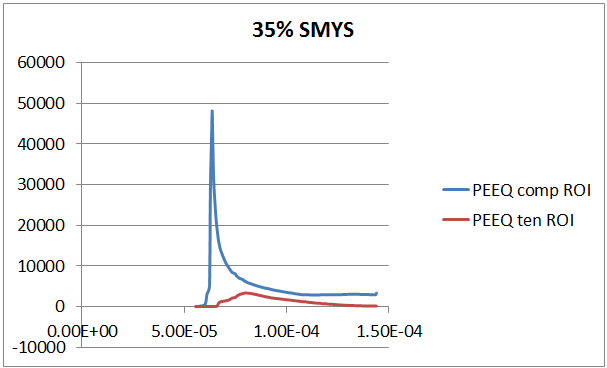

Tension Side Fracture of Cold Bends
===================================================
Cold bending is applied in order to change the direction of a pipeline in a horizontal or vertical plane. This can be necessary to conform with the terrain conditions. Cold bending is done on site using cold bending machines. In the process of cold bending the compression side (intrados) of the pipe can be loaded beyond the yield stress in compression whereas the tension side (extrados) can be loaded beyond yield stress in tension. As a result the intrados is weakened and more likely to fail after cold bending. However, experimental studies carried out by Sen et al demonstrated that failure of a cold bend at the tension side can occur earlier than compressive failure under certain loading configurations (Sen_).

.. _coldBendTestMat:

+------------------+---------------------------------------------------+
|       Geometry and Material Properties of TCPL1                      |
+==================+===================================================+
| Nominal diameter |        762 mm                                     |
+------------------+---------------------------------------------------+
| Wall thickness   |        8.2 mm                                     |
+------------------+---------------------------------------------------+
| Grade            |   X65                                             |
+------------------+---------------------------------------------------+
| Curvature        |  Bent 1 degree per diameter in length             |
+------------------+---------------------------------------------------+
|Bend angle        | 9 degrees                                         |
+------------------+---------------------------------------------------+
| SMYS             |     448 MPa                                       |
+------------------+---------------------------------------------------+
|Internal pressure |   80% SMYS hoop stress                            |
+------------------+---------------------------------------------------+

Rate of Increase of the PEEQ at the compression and tension sides at different levels of internal pressure
-----------------------------------------------------------------------------------------------------------

.. _35PercX65:

.. container:: clearer

   .. image :: spacer.png

Axial and Hoop Stresses as Functions of Internal Pressure, Diameter and Wall Thickness
-------------------------------------------------------------------------------------------
The relationship between the wall thickness :math:`(t)`, pipe outer diameter :math:`(OD)`, internal pressure :math:`(p_i)` and the longitudinal stress on the pipe wall caused by these variables :math:`(\sigma_l)` is given as 

.. math:: \sigma_l = \frac{p_i \cdot (OD/2-t)^2}{t \cdot D_{ave}} 

where :math:`D_{ave}=\displaystyle\frac{OD+(OD-2t)}{2}=OD-t`. :math:`\quad\sigma_l` occurs in test setups due to the axial force exerted by the end plates. The hoop stress :math:`\sigma_h` has a magnitude 2 times greater than the longitudinal stress the derivation of which is lengthy and omitted at this point.

.. math:: \sigma_h=\frac{2\cdot p_i(OD/2-t)^2}{t\cdot D_{ave}}  

Based on these definitions, the following plots are created for an X52 pipe with an internal pressure causing 80% SMYS hoop stress. 

.. _MPavsOD:
.. figure:: MPavsOD.jpg
   :height: 614px
   :width: 903 px
   :scale: 85 %
   :align: center

.. _PSIvsOD:
.. figure:: PSIvsOD.jpg
   :height: 614px
   :width: 903 px
   :scale: 85 %
   :align: center

**References**

.. _Sen: 

Sen M. (2006); “Behaviour of Cold Bend Pipes Under Combined Loads” Ph.D. dissertation, University of Alberta, 2006

.. _Sen2: 

Sen M., Cheng, J.J.R. , Zhou, J. (2011).  `Behaviour of Cold Bend Pipes under Bending Loads <http://ascelibrary.org/doi/pdf/10.1061/%28ASCE%29ST.1943-541X.0000219>`_ , DOI: 10.1061/(ASCE)ST.1943-541X.0000219. 2011 American Society of Civil Engineers 

.. _Sen3:

Sen M, Cheng JJR, Murray DW (2004). `Full-Scale Tests of Cold Bend Pipes <http://www.google.ca/url?sa=t&rct=j&q=&esrc=s&source=web&cd=1&ved=0CCsQFjAA&url=http%3A%2F%2Fproceedings.asmedigitalcollection.asme.org%2Fdata%2FConferences%2FIPC2004%2F71304%2F419_1.pdf&ei=IWc3U7XDFsO-sQSuqYCoCA&usg=AFQjCNEZSf_5saGujIrEysYVZy1mse4I8g&sig2=ggMyIzYQkJPTyYfUWaQ7Ig&bvm=bv.63808443,d.cWc>`_ , Proceedings of IPC2004, International Pipeline Conference, IPC2004 – 743 