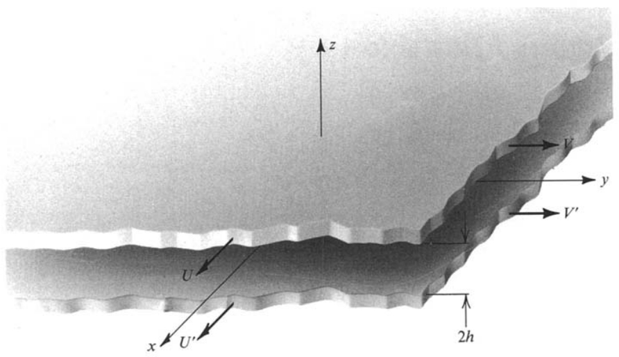

Flow Between Parallel Plates
=================================
This section is about the computation and visualization of the velocity and pressure fields in an incompressible fluid between two parallel infinitely large plates using OpenFOAM and ParaView. The results obtained by OpenFOAM are compared to the analytical solutions available for this particular flow case. 

Analytical Solution
~~~~~~~~~~~~~~~~~~~~~~~

The fluid is set in motion due to the shear forces caused by the movement of the plates relative to each other. The positions and velocities of the plates are given in Figure 1 with respect to a cartesian coordinate system (x,y,z). 

.. _Plates:

   Figure 1: Parallel plates and the cartesian coordinate system [1_]

The plates are a distance 2h apart from each other and the coordinate system is centered in the middle of this distance so that the top plate is located at z=h and the bottom plate is located at z=-h. The Navier-Stokes equations describing incompressible fluid flow in x,y,z directions are given below [1_]:

x-direction: 

.. math::
   \frac{\partial u}{\partial t}+u\frac{\partial u}{\partial x}+v\frac{\partial u}{\partial y}+w\frac{\partial u}{\partial z}=-\frac{1}{\rho}\frac{\partial p}{\partial x}+\nu\cdot \Big(\frac{\partial^2 u}{\partial x^2}+\frac{\partial ^2 u}{\partial y^2}+\frac{\partial^2 u}{\partial z^2}\Big)

y-direction:

.. math::
   \frac{\partial v}{\partial t}+u\frac{\partial v}{\partial x}+v\frac{\partial v}{\partial y}+w\frac{\partial v}{\partial z}=-\frac{1}{\rho}\frac{\partial p}{\partial y}+\nu\cdot \Big(\frac{\partial^2 v}{\partial x^2}+\frac{\partial ^2 v}{\partial y^2}+\frac{\partial^2 v}{\partial z^2}\Big)

z-direction:

.. math::
   \frac{\partial w}{\partial t}+u\frac{\partial w}{\partial x}+v\frac{\partial w}{\partial y}+w\frac{\partial w}{\partial z}=-g-\frac{1}{\rho}\frac{\partial p}{\partial z}+\nu\cdot \Big(\frac{\partial^2 w}{\partial x^2}+\frac{\partial ^2 w}{\partial y^2}+\frac{\partial^2 w}{\partial z^2}\Big)

In the Navier-Stokes equation for the z-direction the g term denotes the gravitational constant. In all equations :math:`\nu` is the kinematic viscosity of the fluid, :math:`p` is the pressure and :math:`u,v,w` are the velocity components in the x,y,z directions respectively. The steady state flow assumption requires the local time derivatives of the velocity components (:math:`\frac{\partial u}{\partial t}, \frac{\partial v}{\partial t},\frac{\partial w}{\partial t}`) to be equal to zero. Another assumption is that the pressure changes only in x and z directions. The no-slip boundary conditions are given below:

.. math::
   u=U,\quad v=V \quad \text{at z=h}

.. math::
   u=U',\quad v=V' \quad \text{at z=-h}   

In order to obtain the velocity profile at an arbitrary point, the velocity components :math:`u` and :math:`v` are assumed to be functions of z only such that :math:`\mathbf{V}=u(z)\mathbf{e}_1+v(z)\mathbf{e}_2` where :math:`\mathbf{V}` denotes the velocity vector field and :math:`\mathbf{e}_1` and :math:`\mathbf{e}_2` denote the unit vectors in x and y directions respectively.

Here is a list of assumptions that we made so far to describe fluid flow between two infinitely large plates moving with respect to each other:

* The flow is parallel to the plates :math:`\Rightarrow w=0`
* Steady flow :math:`\Rightarrow \displaystyle\frac{\partial u}{\partial t}=\displaystyle\frac{\partial v}{\partial t}=\displaystyle\frac{\partial w}{\partial t}=0`
* :math:`\displaystyle\frac{\partial p}{\partial y}=0`
* :math:`\mathbf{V}=u(z)\mathbf{e}_1+v(z)\mathbf{e}_2` 

The application of the above assumptions to the Navier-Stokes equations yields the following simplified governing equations of fluid motion:

.. math::
  \begin{matrix}\text{x-direction:}\\ \text{y-direection:} \\ \text{z-direction:}\end{matrix} \begin{pmatrix}0\\0\\0\end{pmatrix}=\begin{pmatrix}-(1/\rho)\partial_x p+\nu u''\\ \nu v'' \\ -g-(1/\rho)\partial_z p\end{pmatrix}

or

.. math::
   \Big[-\displaystyle\frac{1}{\rho}\partial_x p+\nu u''\Big]\mathbf{e}_1+\Big[\nu v''\Big]\mathbf{e}_2+\Big[-g-\displaystyle\frac{1}{\rho}\partial_z p\Big]\mathbf{e}_3=0

In the above equations :math:`\partial_x` and :math:`\partial_z` stand for the partial derivatives with respect to x and z respectively. By integrating the z-direction simplified Navier-Stokes equation once we obtain:

.. math::
   p(x,z)=-g\rho z+f_1(x) \qquad (1)

From the above description of :math:`p(x,z)` it follows that :math:`\partial_x p=\partial_x f_1`. Plugging this relationship into the x-direction simplified Navier-Stokes equation we obtain:

.. math::
   \rho\nu u''=\partial_x f_1

Since in the above equation the left hand side is a function of z only and the right hand side is a function of x only, both the left and the right hand sides must be equal to a constant value such that:

.. math::
  \rho \nu u''=\partial_x f_1=\partial_x p=C
   
A second expression for the pressure field can be obtained by integrating the equation :math:`\partial_x p=C` with respect to x once. This expression is given in Eq.(2)

.. math::
   p(x,z)=Cx+f_2(z)  \qquad (2)

A comparison of Eq.(1) and Eq.(2) shows that :math:`f_1(x)=Cx` and :math:`f_2(z)=-g\rho z`. Using this, the pressure field can be described as in Eq.(3) where :math:`p_0` is the pressure at the point x=0, z=0.

.. math::
   \boxed{p(x,z)=Cx-g\rho z + p_0} \qquad (3)

Furthermore, integrating the equation :math:`\rho \nu u''=C` with respect to z twice, we obtain Eq.(4) which describes the x-component of the velocity field:

.. math::
   u(z)=\displaystyle\frac{C}{2\rho\nu}z^2+c_1z+c_2 \qquad (4)

Applying the boundary conditions for u at z=-h and at z=h, the constants of integration :math:`c_1,c_2` can be computed as in Eq.(5).

.. math::
   \boxed{u(z)=\displaystyle\frac{C}{2\rho\nu}z^2+\displaystyle\frac{U-U'}{2h}z+\displaystyle\frac{U+U'}{2}-\displaystyle\frac{Ch^2}{2\rho\nu}}\qquad (5)
  
Similarly, the velocity field in y-direction can be obtained by integrating the equation :math:`\nu v''=0` (the Navier-Stokes equation for y-direction) twice with respect to z and using the boundary conditions for v at z=-h and at z=h as in Eq.(6).

.. math::
   \boxed{v(z)=\displaystyle\frac{V-V'}{2h}z+\displaystyle\frac{V+V'}{2}}\qquad (6)

A sub-class of flow between parallel plates is called Couette flow which occurs when :math:`\partial_x p=0` in addition to the assumptions listed previously. In the next section about the simulation in OpenFOAM the Couette flow is demonstrated first before the more general case of :math:`\partial_xp \neq 0` which is called Poiseuille flow.
 
Numerical Solution using OpenFOAM
~~~~~~~~~~~~~~~~~~~~~~~~~~~~~~~~~~~

**References**

.. _1: 

[1] Granger R.A., Fluid Mechanics, Dover Publications, 1995, ISBN:9781621986546
