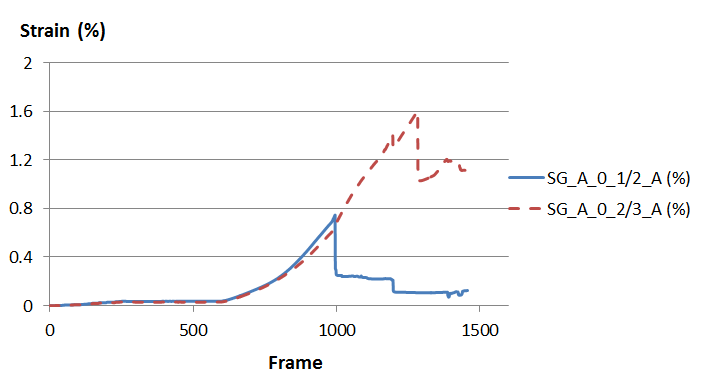
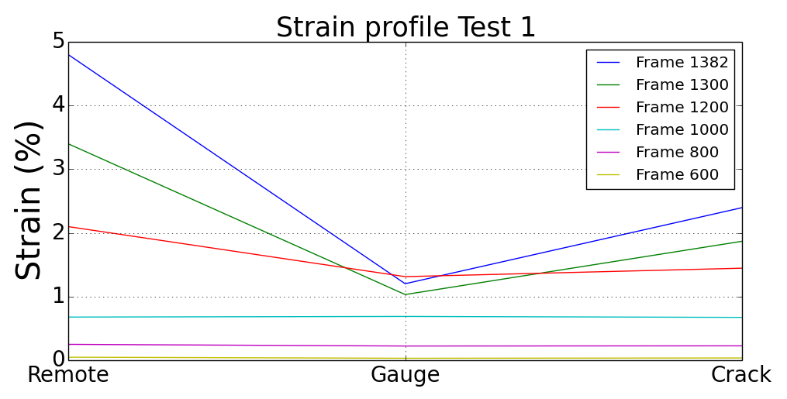
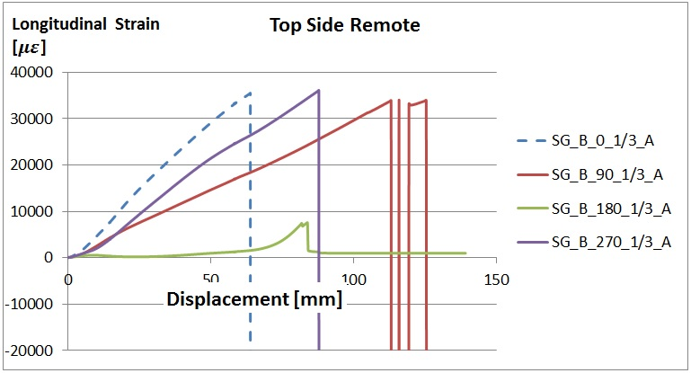
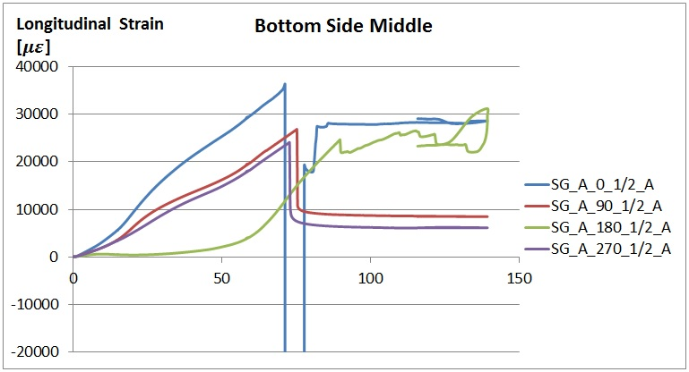
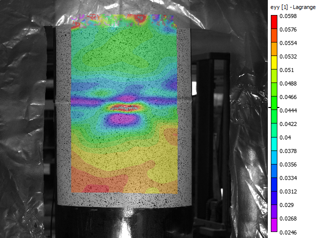
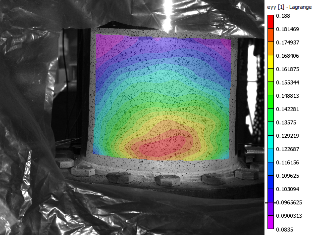
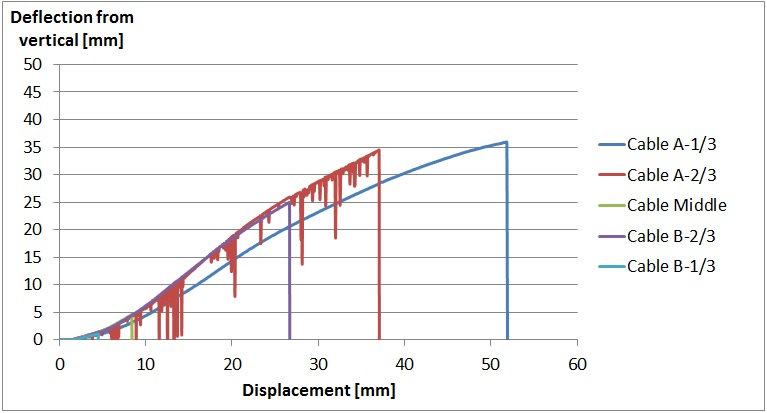
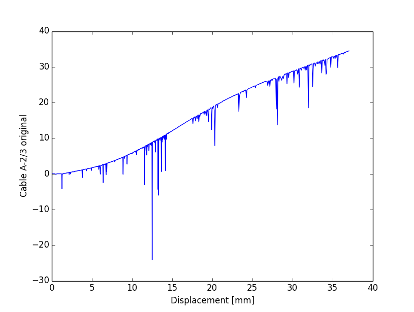
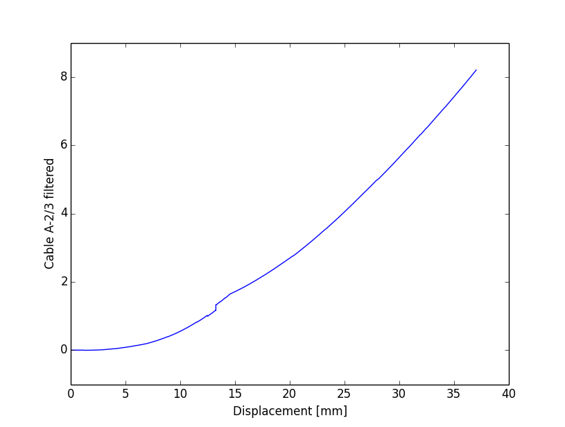
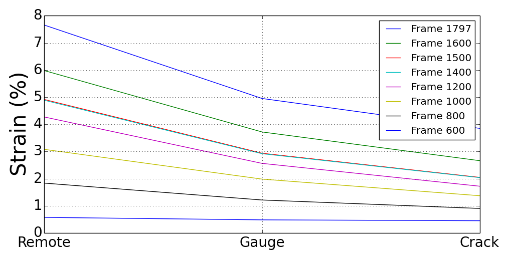

Design and Outcome of Tensile Strain Experiments
===================================================
This  section  explains  the  general  design  process  of  the  full scale  specimen  as  well  as  the  details  of  the  preliminary numerical analysis. Based on the estimated forces acting on the specimen, proper dimensions are determined for the end plates. Also  this  section  describes  the  test  setup  and  the  flaw cutting procedure schematically.

In the scope  of this project  a total of 8  full scale  experiments (testMat_)  will  be  carried  out. 

.. _testMat:
.. csv-table:: **Test matrix**
   :header: "Test number", "Specimen length", "Internal pressure (% SMYS)", "Flaw length [mm]", "Flaw depth [mm]"
   :widths: 5, 5, 7, 5, 5	

   "1", 72", "80", "50", "1.7"
   "2", 72", "30", "50", "1.7"
   "3", 72", "80", "50", "3.4"
   "4", 72", "30", "50", "3.4"
   "5", 48", "80", "150", "1.7"
   "6", 48", "30", "150", "1.7"
   "7", 48", "80", "150", "3.4"
   "8", 48", "30", "150", "3.4" 

.. _pipeSpecs:

+------------------+---------------------------------------------------+
|       Nominal Pipe Specifications                                    |
+==================+===================================================+
| OD               |        324 mm                                     |
+------------------+---------------------------------------------------+
| Wall thickness   |   6.91 mm  and some 7.16 mm heavy wall sections   |
+------------------+---------------------------------------------------+
| Grade            |   359 MPa                                         |
+------------------+---------------------------------------------------+
| Coating          |   Extruded Polyethylene (a.k.a. yellow jacket)    |
+------------------+---------------------------------------------------+
| Long seam        |   ERW                                             |
+------------------+---------------------------------------------------+
| Vintage          |   1983                                            |
+------------------+---------------------------------------------------+
| Manufacturer     |   IPSCO                                           |
+------------------+---------------------------------------------------+

End Plate Design
-----------------------------------
First Tensile Strain Experiment
-----------------------------------

Strain measurements of the first test
--------------------------------------

.. _Axial0ATest1:

   Axial strain gauge measurements at the bottom side of the specimen

.. _firstStrainProfile:

   Strain profile of the first full scale specimen.

In Test 1 strain gauge data was available throughout the test ( :ref:`Axial strain gauges bottom side 1<Axial0ATest1>`). However this time instead of the gauge in the middle, the gauge 2 OD away from the end plate is used in the plots( :ref:`strain profile 1<firstStrainProfile>`). The reason for this was the erroneous measurements of the middle gauge. In  :ref:`strain profile 1<firstStrainProfile>`, the profile of each frame is plotted by joining strain at three different points on the pipe surface. The point denoted by **Remote** is where the strain is obtained from the edge of the DIC area of interest close to the end plate. The point denoted by **Gauge** is where the strain is measured using an axial strain gauge located in the mid-length of the bottom side of the girth weld. The point denoted by **Crack** is where the strain is obtained from the edge of the DIC area of interest around the flaw.

.. container:: clearer

    .. image :: spacer.png

Second Tensile Strain Experiment
-----------------------------------

.. _secondTest:

+------------------+------------------------+
|              Test Configuration           |
+==================+========================+
| Flaw length      |   50 mm                |
+------------------+------------------------+
| Flaw depth       |   1.7 mm               |
+------------------+------------------------+
| Internal pressure|   30% SMYS (4.79 MPa)  |
+------------------+------------------------+
| Specimen length  |   72"                  |
+------------------+------------------------+

.. _Specimen2:
.. figure:: Pipe2.jpg
   :height: 2304px
   :width: 1296 px
   :scale: 25 %
   :align: left

   Second full scale specimen.

The focus of the second tensile strain experiment is the effect of internal pressure on the tensile strain capacity of the pipe. The tensile strain that the pipe experiences due to internal pressure and applied tensile displacement is measured using strain gauges and digital image correlation. The white painted and speckled areas in Figure(:ref:`Specimen2`) are the areas where the strain field is captured throughout the experiment using digital image correlation. The white area in the middle of the pipe is where the girth weld and the heat affected zone (HAZ) are located. The flaw is cut in the HAZ within 5 mm from the girth weld. 

In addition to digital image correlation, 19 strain gauges are mounted on different parts of the pipe surface. Since the cameras are not high enough to take pictures of the upper parts of the pipe, in these parts the strain values are measured using strain gauges(:ref:`Remote Strain Gauges`). Also at the mid-sections of both upper and lower parts of the pipe two rings of strain gauges are mounted in longitudinal and hoop directions. 

.. container:: clearer

    .. image :: spacer.png

Strain measurements of second test
-----------------------------------

.. _Remote Strain Gauges:

   Remote strain at the top side

Figure(:ref:`Remote Strain Gauges`) shows strain measurements of the gauges one OD away from the top side end plate. The strain gauge measurements in Figure(:ref:`Remote Strain Gauges`) were able to record longitudinal strain values up to about 3.5% longitudinal strain. At this strain level all three gauges measuring tensile strain failed. This is expected since the gauges are designed to measure strain values up to 3%. In this Figure the strain gauges aligned with the flaw, 90° away from the flaw, 180° away from the flaw and 270° away from the flaw are plotted with blue, brown, green and purple colours respectively. The dropping of the measurements below zero indicates the failure of the strain gauge during the test. Therefore Figure(:ref:`Remote Strain Gauges`) gives only partial information about the development of the remote strain. It can be seen that the green curve measured negligible strain values. This indicates that on the side of the pipe opposite to the flaw, the tensile strains due to applied tension and compressive strains due to bending almost cancel each other.

.. _Middle Strain Gauges Top:
.. figure:: NW2_TopSideMiddleGauges.jpg
   :height: 415px
   :width: 769 px
   :scale: 85 %
   :align: center

   Middle strain at the top side

.. _Middle Strain Gauges Bottom:

   Middle strain at the bottom side

.. _HAZ Image Cor:

   HAZ image correlation for tensile strain

.. _Remote Image Cor:

   Remote strain image correlation

In the diagrams of Figure(:ref:`Remote Strain Gauges`), Figure(:ref:`Middle Strain Gauges Top`) and Figure(:ref:`Middle Strain Gauges Bottom`) the notation used to label the strain gauges is explained on an example in the table below.

+------------+--------------------------------------------------------------------------------------+
| SG_A_0_1/2_A                                                                                      |
+============+======================================================================================+
| SG         | Strain gauge                                                                         |
+------------+--------------------------------------------------------------------------------------+
| First A    | Bottom side of the pipe  (Here B would indicate the top side)                        |
+------------+--------------------------------------------------------------------------------------+
| 0          | 0 degrees away from the girth weld flaw center in the circumferential direction      |
+------------+--------------------------------------------------------------------------------------+
| 1/2        | 1/2 of the specimen half length away from the end plate                              |
+------------+--------------------------------------------------------------------------------------+
| Second A   | Gauge is in the axial direction (Here H would indicate hoop direction)               |
+------------+--------------------------------------------------------------------------------------+

Deflection of the Pipe Axis
-----------------------------
In order to measure the deflection of the pipe axis 5 cable transducers are connected on the pipe surface. For this purpose a steel column is placed in front of the pipe on the opposite side of the flaw (Figure(:ref:`Specimen2`)). Cable transducers are connected to the beam using magnets. On the pipe side opposite to every cable transducer a nut is glued on the pipe surface using epoxy. Afterwards an eye bolt is screwed into each nut. The eye bolts are connected to the cable transducers using soldering wire.

.. _Deflections:

   Pipe axis deflections

Figure(:ref:`Deflections`) shows the development of the deflections with respect to applied displacement. In this plot the displacement axis is limited to 60 mm since beyond that point no measurements could be made. The reason for that is the failure of the epoxy glue between the nut and the pipe surface when the tensile force on the soldering wire increases. The dropping of the value to zero indicates this failure. The notation used to label the cable transducers is explained on an example in the table below.

+------------+--------------------------------------------------------------------------------------+
| Cable A-1/3                                                                                       |
+============+======================================================================================+
| Cable      | Cable transducer                                                                     |
+------------+--------------------------------------------------------------------------------------+
| A          | Bottom side of the pipe                                                              |
+------------+--------------------------------------------------------------------------------------+
| 1/3        | The deflection is measured 1/3 of the specimen half length away from the end plate   |
+------------+--------------------------------------------------------------------------------------+

In Figure(:ref:`Deflections`) the measurements of the cable transducer on the bottom side 2/3 of the specimen half length away from the end plate appear to be noisy. In order to eliminate this noise, the measurements of this tranducer are filtered using an EWMA (:ref:`EWMA`) filter. 

.. _CableA2_3Original:

.. _CableA2_3Filtered:

.. container:: clearer

    .. image :: spacer.png

Strain Profile of the Second Experiment
~~~~~~~~~~~~~~~~~~~~~~~~~~~~~~~~~~~~~~~~

.. _secondStrainProfile:

   Strain profile of the second full scale specimen.

In the second full scale test, starting from Frame 800 significant strain values are recorded. In  :ref:`strain profile 2<secondStrainProfile>`, the profile of each frame is plotted by joining strain at three different points on the pipe surface. The point denoted by **Remote** is where the strain is obtained from the edge of the DIC area of interest close to the end plate. The point denoted by **Gauge** is where the strain is measured using an axial strain gauge located in the mid-length of the bottom side of the girth weld. The point denoted by **Crack** is where the strain is obtained from the edge of the DIC area of interest around the flaw.   