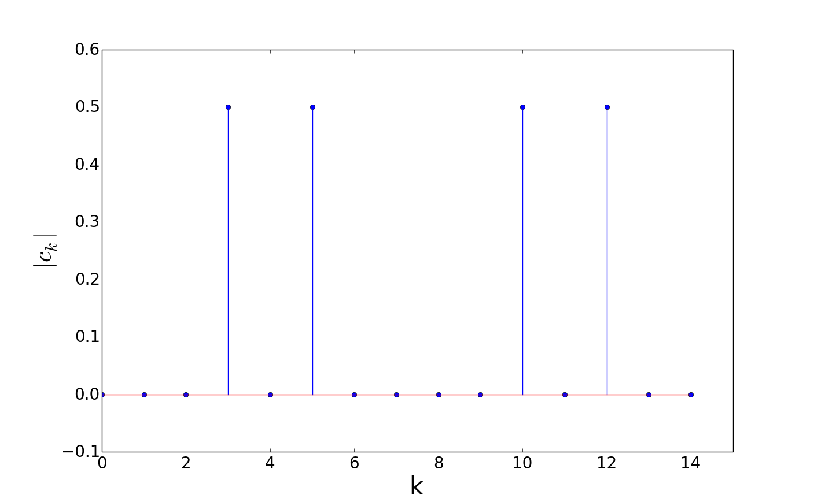
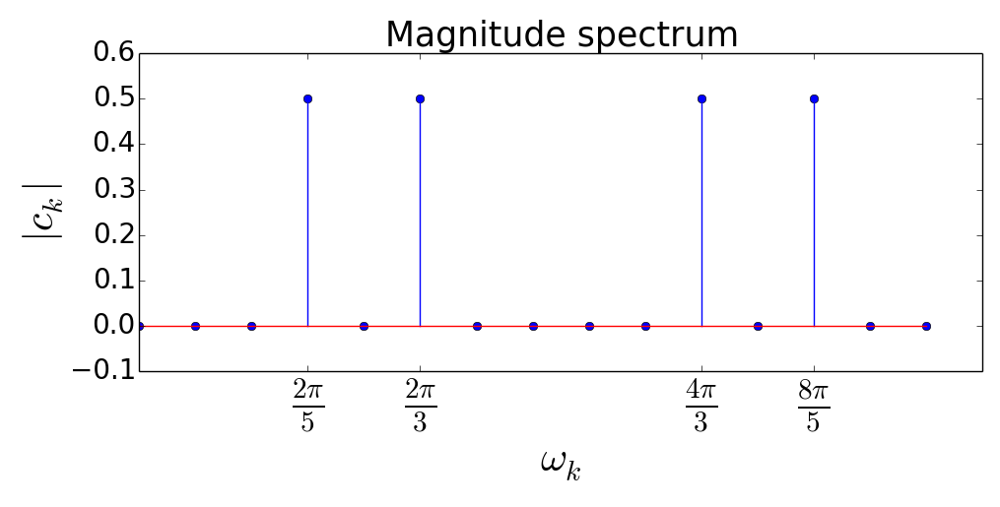
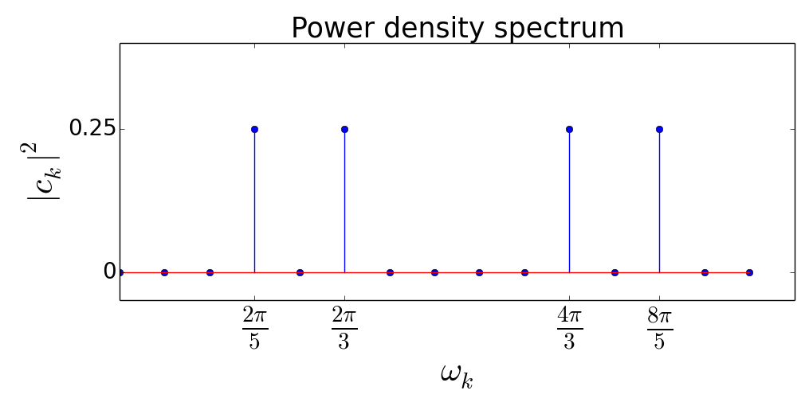
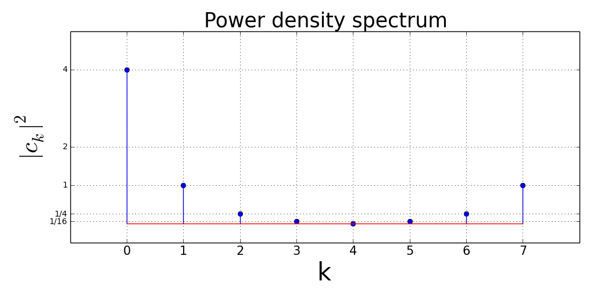
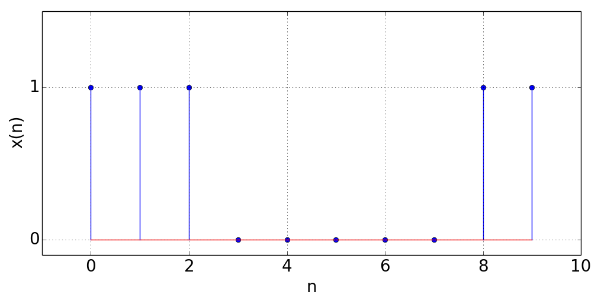
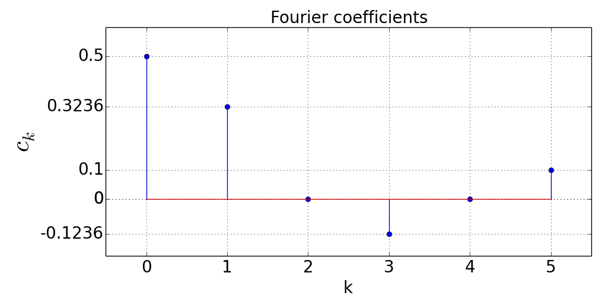
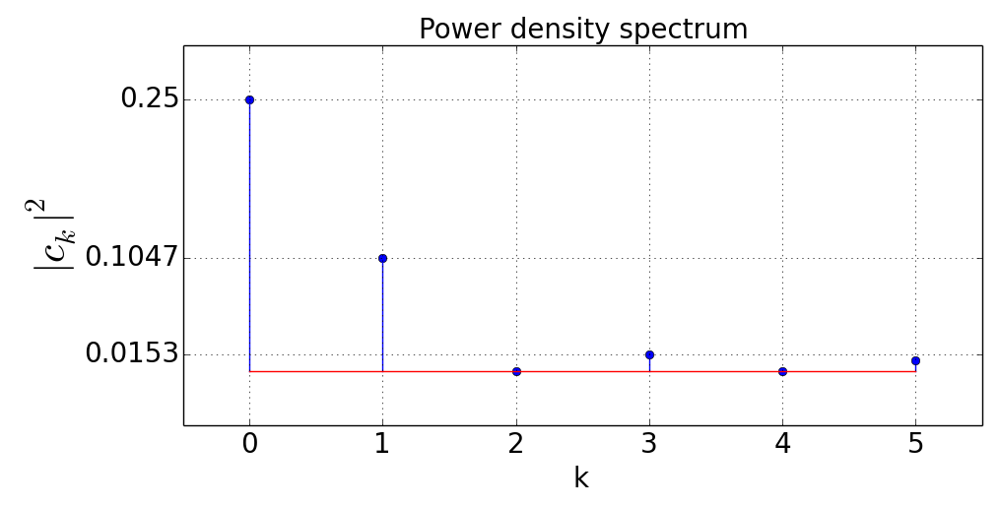

Fourier Series and the Fourier Transform
==================================================

Fourier Series
---------------------------
The Fourier series representation of a periodic discrete-time signal :math:`x(n)` is defined as

.. math:: x(n)=\sum_{k=0}^{N-1}c_k e^{j2\pi kn/N}
	:label: fourier

where :math:`N` is the fundamental period of :math:`x(n)`. In equation :eq:`fourier`, :math:`c_k` denotes the Fourier coefficients of :math:`x(n)` and they represent the frequency components contained in :math:`x(n)`. For each :math:`k \in \lbrace 0, 1, ..., N-1 \rbrace`, :math:`c_k` can be calculated as

.. math:: c_k=\frac{1}{N}\sum_{n=0}^{N-1}x(n)e^{-j2\pi kn/N}
	:label: fourierCoeff

Equation :eq:`fourierCoeff` can be derived applying the following 4 steps:

- **Step 1**: Both sides of equation :eq:`fourier` are multiplied by :math:`e^{-j2\pi ln/N}`, where :math:`l \in \lbrace 0, 1, ..., N-1 \rbrace`.

.. math:: x(n) e^{-j2\pi ln/N} & = \sum _{k=0}^{N-1} c_k e^{j 2\pi (k-l) n/N }                        \\
        	             & = \sum _{k=0}^{N-1} c_k \Big\lbrace e^{j2\pi (k-l)/N}\Big\rbrace^n   \\
        	  :label: fourierArranged
    
- **Step 2**: Let :math:`r=e^{j2\pi (k-l)/N}` and sum both sides of equation :eq:`fourierArranged` over the index :math:`n`

.. math::
	:label: fourierSum1

	\sum _{n=0}^{N-1}x(n)e^{-j2\pi ln/N} = \sum _{k=0}^{N-1} c_k \sum _{n=0}^{N-1} r^n

- **Step 3**: Using the geometric series summation:

.. math::
	
	\begin{equation*}
	\sum _{n=0}^{N-1} r^n= \left\{ \begin{array}{ll}
  N & \mbox{ if $ k=l$}\\
   \displaystyle\frac{1-r^N}{1-r} & \mbox{ if $k \neq l$}
  \end{array}
  \right. = \left\{ \begin{array}{ll}
  N & \mbox{ if $ k=l$}\\
   \displaystyle\frac{1- e^{j2\pi (k-l)} }{1-e^{j2\pi (k-l)/N}} & \mbox{ if $k \neq l$}
  \end{array}
  \right.
  \end{equation*}

.. math:: e^{j2\pi (k-l)}=\cos{2\pi (k-l)} + j\sin{2\pi (k-l)}=1 \Rightarrow \sum _{n=0}^{N-1} r^n= \left\{ \begin{array}{ll}
  N & \mbox{ if $ k=l$}\\
   0 & \mbox{ if $k \neq l$}
  \end{array}
  \right.

- **Step 4**: Plugging the result of step 3 in equation :eq:`fourierSum1` we obtain:

.. math:: \sum _{n=0}^{N-1}x(n)e^{-j2\pi ln/N} = c_0 \cdot 0 + c_1 \cdot 0 + ... + c_l \cdot N + c_{l+1}\cdot 0 + ... +c_{N-1}\cdot 0 = c_l \cdot N

.. math:: c_l=\frac{1}{N}\sum _{n=0}^{N-1}x(n)e^{-j2\pi ln/N}

.. _fourierEx1:

**Example 1:** Determine the Fourier coefficients of the signal :math:`x(n)=\cos(\displaystyle\frac{2\pi}{3}n)+\sin(\displaystyle\frac{2\pi}{5}n)`.

.. math:: x(n)=\frac{1}{2}e^{\displaystyle{j\frac{2\pi}{3}n}}+\frac{1}{2}e^{\displaystyle{j\Big(-\frac{2\pi}{3}\Big)n}}+\frac{1}{2j}e^{\displaystyle{j\frac{2\pi}{5}n}}-\frac{1}{2j}e^{\displaystyle{j\Big(-\frac{2\pi}{5}\Big)n}}

.. math:: e^{\displaystyle{j\Big(-\frac{2\pi}{3}\Big)n}}=e^{\displaystyle{j\Big(-\frac{2\pi}{3}+2\pi\Big)n}}=e^{\displaystyle{j\frac{4\pi}{3}n}}, \quad e^{\displaystyle{j\Big(-\frac{2\pi}{5}\Big)n}}=e^{\displaystyle{j\Big(-\frac{2\pi}{5}+2\pi\Big)n}}=e^{\displaystyle{j\frac{8\pi}{5}n}}

.. math:: \Rightarrow x(n)=\frac{1}{2j}e^{\displaystyle{j\frac{2\pi}{5}n}}+\frac{1}{2}e^{\displaystyle{j\frac{2\pi}{3}n}}+\frac{1}{2}e^{\displaystyle{j\frac{4\pi}{3}n}}-\frac{1}{2j}e^{\displaystyle{j\frac{8\pi}{5}n}}
  :label: quiz41bxn

Let :math:`x_1(n)=\cos(2\pi\frac{1}{3}n)`, :math:`x_2(n)=\sin(2\pi\frac{1}{5}n)`. 
 The fundamental periods of :math:`x_1` and :math:`x_2` are  :math:`=3` and :math:`5`respectively. The fundamental period of :math:`x(n)` is the smallest common factor of these two funsamental periods such that :math:`N=15`. It follows that

.. math::  x(n)=\sum_{k=0}^{14}c_k e^{\displaystyle{j\frac{2\pi}{15}kn}}
  :label: ex1eq1

The only nonzero terms in :eq:`ex1eq1` are the ones in :eq:`quiz41bxn`  

.. math:: j\frac{2\pi}{5}n=j\frac{2\pi}{15}3n \Rightarrow k=3, c_3=-j/2 \quad;\quad j\frac{2\pi}{3}n=j\frac{2\pi}{15}5n \Rightarrow k=5, c_5 =1/2

.. math:: j\frac{4\pi}{3}n=j\frac{2\pi}{15}10n \Rightarrow k=10, c_{10}=1/2 \quad;\quad j\frac{8\pi}{5}n=j\frac{2\pi}{15}12n \Rightarrow k=12, c_{12} =j/2

.. _Quiz41b1:

.. _Quiz41b2:

.. container:: clearer

    .. image :: spacer.png

The 2 plots above show the magnitude spectra of the 4 frequency components contained in :math:`x(n)`. In the second plot :math:`\omega_k` denotes the frequency component associated with the index :math:`k`. The python code for generating the magnitude spectrum plots is given below::

  import numpy as np
  import matplotlib.pyplot as plt

  kList=list(range(0,15)) #List of k values
  omegakList=[2*np.pi*x/15 for x in kList] #List of omegak values
  ckList=[0, 0, 0, -0.5j, 0, 0.5, 0, 0, 0, 0, 0.5, 0, 0.5j, 0, 0]
  ckMagList=[abs(x) for x in ckList]#List containing the magnitudes of ck
  print ckList
  print ckMagList
  #Plotting the magnitude spectrum with k values on x axis
  f1=plt.figure(figsize=(10,5))
  plt.stem(kList, ckMagList)
  plt.ylim([-0.1,0.6])
  plt.xlim([0,15])
  plt.xlabel(r'k', size=30)
  plt.ylabel(r'$|c_k|$', size=30)
  plt.title('Magnitude spectrum', size=25)
  plt.tick_params(axis='x', labelsize=20)
  plt.tick_params(axis='y', labelsize=20)
  f1.tight_layout()
  plt.show(f1)
  #Plotting the magnitude spectrum with omegak values on x axis
  f2=plt.figure(figsize=(10,5))
  plt.stem(omegakList, ckMagList)
  plt.ylim([-0.1,0.6])
  plt.xlim([0,2*np.pi])
  omegak=[2*np.pi/5, 2*np.pi/3, 4*np.pi/3, 8*np.pi/5]
  omegakLabels=[r"$\frac{2\pi}{5}$",r"$\frac{2\pi}{3}$", r"$\frac{4\pi}{3}$", r"$\frac{8\pi}{5}$"] 
  plt.xticks(omegak,omegakLabels)
  plt.xlabel(r'$\omega_k$', size=30)
  plt.ylabel(r'$|c_k|$', size=30)
  plt.title('Magnitude spectrum', size=25)
  plt.tick_params(axis='x', labelsize=30)
  plt.tick_params(axis='y', labelsize=20)
  f2.tight_layout()
  plt.show(f2)

Power density spectrum of a periodic signal
~~~~~~~~~~~~~~~~~~~~~~~~~~~~~~~~~~~~~~~~~~~~~~~~

The power of a periodic signal :math:`x(n)` with the fundamental period :math:`N` can be calculated using the formula 

.. math:: P_x=\sum_{k=0}^{N-1} |c_k|^2

This formula can be derived from the formula of the power of a general signal in the following steps:

- **Step 1:** The power of a general signal :math:`x(n)` is defined as

.. math:: P_x=\lim_{N\to\infty}\frac{1}{2N+1}\sum_{n=-N}^{N} |x(n)|^2

According to this formula the power of the signal is equal to the average value of :math:`|x(n)|^2` over the entire discrete time domain. In case of a periodic signal, since the fundamental period of the signal is repeating itself, it is enough to take the average of :math:`|x(n)|^2` over the fundamental period as follows

.. math:: P_x=\frac{1}{N}\sum_{n=0}^{N-1}|x(n)|^2
  :label: pxperiodic

- **Step 2:** :eq:`pxperiodic` can be rearranged using the following 2 identities:

.. math:: |x(n)|^2=x(n)\cdot {x(n)}^*

.. math:: {x(n)}^*=\sum_{k=0}^{N-1}{c_k}^*e^{-j2\pi kn/N}
  :label: pxident

The derivation of :eq:`pxident` is as follows:

.. math:: x(n) &= \sum_{k=0}^{N-1}c_k e^{j2\pi kn/N } \\
  &= \sum _{k=0}^{N-1}c_k\lbrace \cos(\displaystyle\frac{2\pi k }{N}n) + j\sin(\displaystyle\frac{2\pi k }{N}n)

For any two complex numbers :math:`z_1, z_2 \in \mathbb{C}`, :math:`((z_1+z_2)^*={z_1}^* + {z_2}^*)`. In order to prove this let :math:`z_1=a_1 + jb_1` and :math:`z_2=a_2 + jb_2`.

.. math:: \Rightarrow (z_1 + z_2)^* &=(a_1 + a_2 + j(b_1 + b_2))^* \\
  & = a_1+a_2-j(b_1 + b_2)=(a_1-jb_1)+(a_2-jb_2)={z_1}^* + {z_2}^*
  :label: conjugateOfsum

Using this result the complex conjugate of :math:`x(n)` can be calculated as

.. math:: {x(n)}^*=\sum_{k=0}^{N-1}\Big\lbrace c_k \cos\Big(\frac{2\pi k}{N}n\Big) + jc_k\sin\Big(\frac{2\pi k }{N}n\Big) \Big\rbrace ^*
  :label: xnstar1

Let :math:`c_k=a_k +jb_k`. Then :eq:`xnstar1` becomes:

.. math:: {x(n)}^* &=\sum_{k=0}^{N-1}\Big\lbrace (a_k + jb_k)\cos\Big(\displaystyle\frac{2\pi k}{N}n\Big) + j(a_k + jb_k)\sin\Big(\displaystyle\frac{2\pi k }{N}n\Big) \Big\rbrace ^* \\
  &=\sum _{k=0}^{N-1}\Big\lbrace \Big( a_k\cos\Big(\displaystyle\frac{2\pi k}{N}n   \Big) - b_k\sin\Big( \displaystyle\frac{2\pi k}{N}n  \Big)  \Big)+j\Big(b_k\cos\Big( \displaystyle\frac{2\pi k }{N}n \Big) + a_k\sin\Big( \displaystyle\frac{2\pi k }{N}n  \Big)  \Big)  \Big\rbrace ^* \\
  &=\sum_{k=0}^{N-1}\Big(a_k\cos\Big(\displaystyle\frac{2\pi k}{N}n\Big) - b_k\sin\Big(\displaystyle\frac{2\pi k}{N}n\Big)\Big)-j\Big(b_k\cos\Big(\displaystyle\frac{2\pi k}{N}n\Big) +a_k\sin\Big(\displaystyle\frac{2\pi k}{N}n\Big)\Big) \\
  &=\sum_{k=0}^{N-1}\Big(a_k -jb_k\Big)\cos\Big(\displaystyle\frac{2\pi k}{N}n\Big)-j\Big(a_k - jb_k\Big)\sin\Big(\displaystyle\frac{2\pi k}{N}n\Big) \\
  &=\sum_{k=0}^{N-1}\Big(a_k - jb_k\Big)\Big(\cos\Big(\displaystyle\frac{2\pi k}{N}n\Big)-j\sin\Big(\displaystyle\frac{2\pi k}{N}n\Big)\Big) \\
  &=\sum_{k=0}^{N-1}{c_k}^* e^{-j2\pi kn/N}
  :label: xnstar2

- **Step 3:** Using equation :eq:`pxident`, the power of a periodic signal :math:`x(n)` can be written as:

.. math:: P_x &= \frac{1}{N}\sum_{n=0}^{N-1}x(n)\sum_{k=0}^{N-1}{c_k}^* e^{-j2\pi kn/N} \\
  &=\sum_{k=0}^{N-1}{c_k}^*\frac{1}{N}\sum_{n=0}^{N-1}x(n)e^{-j2\pi kn/N} \\
  &=\sum_{k=0}^{N-1}{c_k}^*c_k=\sum_{k=0}^{N-1}|c_k|^2
  :label: powerCk

Using equation :eq:`powerCk` the power of the signal in :ref:`Example 1 <fourierEx1>` can be determined as follows:

.. math:: P_x = |c_3|^2 + |c^5|^2 + |c_{10}|^2 + |c_{12}|^2 = 4\Big(\frac{1}{2}\Big)^2 = 1

Each frequency component :math:`\frac{2\pi k}{N}` has a contribution to the total power of the signal. These variation of these contributions constitutes the **power density spectrum** of the signal. In case of :ref:`Example 1 <fourierEx1>` the power density spectrum is plotted below:    

.. _Quiz41b3:

.. _fourierEx2:

**Example 2:** Let :math:`x(n) = 2 + 2\cos\displaystyle\frac{\pi}{4}n + \cos \displaystyle\frac{\pi}{2}n + \displaystyle\frac{1}{2}\cos \displaystyle\frac{3\pi}{4}n`. This signal can be decomposed into :math:`4` components as :math:`x_1(n)=2`, :math:`x_2(n)=2\cos\displaystyle\frac{\pi}{4}n`, :math:`x_3(n)=\cos\displaystyle\frac{\pi}{2}n`, :math:`x_4(n)=\displaystyle\frac{1}{2}\cos\frac{3\pi}{4}n`.

.. math:: x_1(n)\text{ is a constant and doesn't contain a frequency component.}

.. math:: x_2(n)=2\cos\Big(2\pi \frac{1}{8}n\Big) \Rightarrow f_2=1/8 \Rightarrow N_2 = 8

.. math:: x_3(n)=\cos\Big(2\pi \frac{1}{4}n\Big) \Rightarrow f_3=1/4 \Rightarrow N_3 = 4

.. math:: x_4(n)=\displaystyle\frac{1}{2}\cos\Big(2\pi \frac{3}{8}n\Big) \Rightarrow f_4=3/8 \Rightarrow N_4 = 8

The smallest common factor of :math:`N_1, N_2, N_3` is :math:`N=8` which is the fundamental period of the signal.

:math:`x(n)` can be written in form of equation :eq:`fourier` as follows:

.. math:: x_1(n)=2e^{\displaystyle{j0n}}=2e^{\displaystyle{j\frac{2\pi 0}{8}n}} \Rightarrow k=0,\quad \boxed{c_0=2}

.. math:: x_2(n)&=2\Big( \frac{1}{2}e^{\displaystyle{j\frac{\pi}{4}n}}+\frac{1}{2}e^{\displaystyle{-j\frac{\pi}{4}n}}\Big)=e^{\displaystyle{j\frac{\pi}{4}n}}+e^{\displaystyle{j(-\frac{\pi}{4}+2\pi)n}}  \\ &=e^{\displaystyle{j\frac{\pi}{4}n}}+e^{\displaystyle{j\frac{7\pi}{4}n}}=e^{\displaystyle{j\frac{2\pi k_1}{8}n}}+e^{\displaystyle{j\frac{2\pi k_2}{8}n}}\\ &\Rightarrow k_1=1,\quad \boxed{c_1 = 1}, \qquad k_2=7, \quad \boxed{c_7=1}

.. math:: x_3(n)&=\frac{1}{2}e^{\displaystyle{j\frac{\pi}{2}n}}+\frac{1}{2}e^{\displaystyle{-j\frac{\pi}{2}n}}=\frac{1}{2}e^{\displaystyle{j\frac{\pi}{2}n}}+\frac{1}{2}e^{\displaystyle{j(-\frac{\pi}{2}+2\pi)n}} \\ &=\frac{1}{2}e^{\displaystyle{j\frac{\pi}{2}n}}+\frac{1}{2}e^{\displaystyle{j\frac{3\pi}{2}n}}=\frac{1}{2}e^{\displaystyle{j\frac{2\pi k_3}{8}n}}+\frac{1}{2}e^{\displaystyle{j\frac{2\pi k_4}{8}n}} \\ &\Rightarrow k_3 = 2,\quad\ \boxed{c_2 = 1/2}, \qquad k_4 = 6, \quad \boxed{c_6 = 1/2}

.. math:: x_4(n)&=\frac{1}{2}\Big( \frac{1}{2}e^{\displaystyle{j\frac{3\pi}{4}n}}+\frac{1}{2}e^{\displaystyle{-j\frac{3\pi}{4}n}}\Big)=\frac{1}{4}e^{\displaystyle{j\frac{3\pi}{4}n}}+\frac{1}{4}e^{\displaystyle{j(-\frac{3\pi}{4}+2\pi)n}}  \\ &=\frac{1}{4}e^{\displaystyle{j\frac{3\pi}{4}n}}+\frac{1}{4}e^{\displaystyle{j\frac{5\pi}{4}n}}=\frac{1}{4}e^{\displaystyle{j\frac{2\pi k_5}{8}n}}+\frac{1}{4}e^{\displaystyle{j\frac{2\pi k_6}{8}n}}\\ &\Rightarrow k_5=3,\quad \boxed{c_3 = \frac{1}{4}}, \qquad k_6=5, \quad \boxed{c_5=\frac{1}{4}}

Since the signal doesn't have the component :math:`c_4e^{\displaystyle{j\frac{2\pi 4}{8}}}`, :math:`\boxed{c_4 = 0}`. 

.. _Quiz41c:

In case of real valued periodic signals, for even valued :math:`N`, :math:`k \in \lbrace 0, 1, ..., N/2  \rbrace` and for odd valued :math:`N`, :math:`k \in \lbrace 0, 1, ..., (N-1)/2  \rbrace` completely describes the power density spectrum of the signal. In order to prove this we can use the fact that the Fourier series of :math:`x(n)` and :math:`{x(n)}^*` are equal to each other for a real signal.

.. math:: x(n)=\sum_{k=-(N-1)}^{0}c_ke^{\displaystyle{j2\pi k n/N}}&=c_0 + c_{-1}e^{\displaystyle{j2\pi (-1)n/N}} + ... \\ &+ c_{-(N-2)}e^{\displaystyle{j2\pi (-(N-2))n/N}} + c_{-(N-1)}e^{\displaystyle{j2\pi (-(N-1))n/N}}

.. math:: {x(n)}^*=\sum_{k=0}^{N-1}{c_k}^*e^{\displaystyle{-j2\pi k n/N}}&={c_0}^* + {c_1}^*e^{\displaystyle{-j2\pi (1)n/N}} + ... \\ &+ {c_{(N-2)}}^*e^{\displaystyle{-j2\pi (N-2)n/N}} + {c_{(N-1)}}^*e^{\displaystyle{-j2\pi (N-1)n/N}}

.. math:: x(n) = {x(n)}^* \Rightarrow c_0 = {c_0}^*, \quad c_{-1} = {c_1}^*,  . . .,  c_{-(N-2)} = {c_{(N-2)}}^*, \quad c_{-(N-1)} = {c_{(N-1)}}^*

.. math:: c_{-k} = {c_k}^* , \quad \forall k \in {0, ..., N-1}
  :label: realCk

An immediate result of equation :eq:`realCk` is as follows:

.. math:: &|{c_k}^*| = |c_k| = |c_{-k}|=|c_{N-k}| \\ &\angle {c_k}^* = \angle c_{-k} =\angle c_{N-k}= -\angle c_k
  :label: realCk2

In equation :eq:`realCk2` the periodicty of :math:`c_k` and the relationship :math:`\angle {c_k}^*=-\angle c_k` are used. The periodicity of :math:`c_k` implies that :math:`\forall k`, :math:`c_k = c_{k+N}`. This can be shown using equation :eq:`fourierCoeff` as follows:

.. math:: c_{k+N}=\frac{1}{N}\sum_{n=0}^{N-1}x(n)e^{\displaystyle{-j2\pi (k+N)n/N}}=\frac{1}{N}\sum_{n=0}^{N-1}x(n)e^{\displaystyle{-j2\pi kn/N}}e^{\displaystyle{-j2\pi Nn/N}}

.. math:: e^{\displaystyle{-j2\pi n}} = \cos(2\pi n) - j \sin(2\pi n) = 1

.. math:: \Rightarrow c_{k+N}=c_k

In :ref:`Example 2 <fourierEx2>` :math:`x(n)` is a real-valued signal and :math:`N=8`. Therefore :math:`|c_k|^2` for :math:`k \in \lbrace 0, 1, 2,3, 4 \rbrace` completely describes the power density spectrum.

.. _fourierEx3:

**Example 3:** 

.. _fourierEx3fig:

The above plot shows one period of the signal :math:`x(n)`. The fundamental period of the signal is :math:`N=10`. The Fourier coefficients of :math:`x(n)` can be calculated using equation :eq:`fourierCoeff`. For :math:`n \in [3,7]`, :math:`x(n)=0`. Therefore equation :eq:`fourierCoeff` becomes:

.. math:: c_k&=\frac{1}{10}\Big ( x(0)e^{\displaystyle{-j2\pi 0k/10}} + x(1)e^{\displaystyle{-j2\pi 1k/10}} + x(2)e^{\displaystyle{-j2\pi 2k/10}} + x(8)e^{\displaystyle{-j2\pi 8k/10}} + x(9)e^{\displaystyle{-j2\pi 9k/10}}  \Big) \\ &=\frac{1}{10}\Big( 1+ e^{\displaystyle{-j\pi k/5}} + e^{\displaystyle{-j2\pi k/5}} + e^{\displaystyle{-j\pi 8k/5}} + e^{\displaystyle{-j\pi 9k/5}} \Big) \\ &=\frac{1}{10}\Big( 1 + e^{\displaystyle{-j\pi k/5}} + e^{\displaystyle{-j2\pi k/5}} + e^{\displaystyle{j2\pi k/5}} + e^{\displaystyle{j\pi k/5}} \Big) \\ &= \frac{1}{10}e^{\displaystyle{-j2\pi k/5}}\Big( 1+ e^{\displaystyle{j\pi k/5}} + e^{\displaystyle{j2\pi k/5}} + e^{\displaystyle{j3\pi k/5}} + e^{\displaystyle{j4\pi k/5}} \Big)

Let :math:`r=e^{j\pi k/5}`. Then

.. math:: c_k &= \frac{1}{10}r^{-2}\sum_{p=0}^{4}r^p = \frac{1}{10}r^{-2}\left\{ \begin{array}{ll}
  5 & \mbox{ if $ k=0(r=1)$}\\
   \displaystyle\frac{1-r^5}{1-r} & \mbox{ if $k \neq 0(r \neq 1)$}
  \end{array}
  \right. \\
  &=\left\{ \begin{array}{ll}
  1/2 & \mbox{ if $ k=0$}\\
   \frac{1}{10}r^{-2}\displaystyle\frac{r^{5/2}(r^{-5/2}-r^{5/2})}{r^{1/2}(r^{-1/2}-r^{1/2})} & \mbox{ if $k \neq 0$}
  \end{array}
  \right. =\left\{ \begin{array}{ll}
  1/2 & \mbox{ if $ k=0$}\\
   \frac{1}{10}\displaystyle\frac{e^{-j\pi k/2}-e^{j\pi k/2}}{e^{-j\pi k/10}-e^{j\pi k/10}} & \mbox{ if $k \neq 0$}
  \end{array}
  \right. \\
  &=\left\{ \begin{array}{ll}
  1/2 & \mbox{ if $ k=0$}\\
   \frac{1}{10}\displaystyle\frac{-2j\sin(\pi k /2)}{-2j\sin(\pi k /10)} & \mbox{ if $k = 0$}
  \end{array}
  \right. =\left\{ \begin{array}{ll}
  1/2 & \mbox{ if $ k=0$}\\
   \frac{1}{10}\displaystyle\frac{\sin(\pi k /2)}{\sin(\pi k /10)} & \mbox{ if $k \neq 0$}
  \end{array}
  \right.

Since :math:`x(n)` is a real valued periodic signal :math:`c_k` for :math:`k \in [0, 5]` completely describes the power spectrum of the signal

.. _fourierEx3fig2:

.. _fourierEx3fig3:

The Fourier Transform
----------------------------------

The Fourier transform of an aperiodic  :ref:`energy signal<Powen>`  is defined as

.. math:: X(\omega)=\sum_{n=-\infty}^{\infty}x(n)e^{\displaystyle{-j\omega n}}