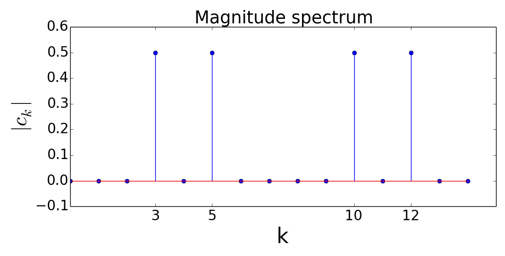

Fourier Series and the Fourier Transform
==================================================

Fourier Series
---------------------------
The Fourier series representation of a periodic discrete-time signal :math:`x(n)` is defined as

.. math:: x(n)=\sum_{k=0}^{N-1}c_k e^{j2\pi kn/N}
	:label: fourier

where :math:`N` is the fundamental period of :math:`x(n)`. In equation :eq:`fourier`, :math:`c_k` denotes the Fourier coefficients of :math:`x(n)` and they represent the frequency components contained in :math:`x(n)`. For each :math:`k \in \lbrace 0, 1, ..., N-1 \rbrace`, :math:`c_k` can be calculated as

.. math:: c_k=\frac{1}{N}\sum_{n=0}^{N-1}x(n)e^{-j2\pi kn/N}
	:label: fourierCoeff

Equation :eq:`fourierCoeff` can be derived applying the following 4 steps:

- **Step 1**: Both sides of equation :eq:`fourier` are multiplied by :math:`e^{-j2\pi ln/N}`, where :math:`l \in \lbrace 0, 1, ..., N-1 \rbrace`.

.. math:: x(n) e^{-j2\pi ln/N} & = \sum _{k=0}^{N-1} c_k e^{j 2\pi (k-l) n/N }                        \\
        	             & = \sum _{k=0}^{N-1} c_k \Big\lbrace e^{j2\pi (k-l)/N}\Big\rbrace^n   \\
        	  :label: fourierArranged
    
- **Step 2**: Let :math:`r=e^{j2\pi (k-l)/N}` and sum both sides of equation :eq:`fourierArranged` over the index :math:`n`

.. math::
	:label: fourierSum1

	\sum _{n=0}^{N-1}x(n)e^{-j2\pi ln/N} = \sum _{k=0}^{N-1} c_k \sum _{n=0}^{N-1} r^n

- **Step 3**: Using the geometric series summation:

.. math::
	
	\begin{equation*}
	\sum _{n=0}^{N-1} r^n= \left\{ \begin{array}{ll}
  N & \mbox{ if $ k=l$}\\
   \displaystyle\frac{1-r^N}{1-r} & \mbox{ if $k \neq l$}
  \end{array}
  \right. = \left\{ \begin{array}{ll}
  N & \mbox{ if $ k=l$}\\
   \displaystyle\frac{1- e^{j2\pi (k-l)} }{1-e^{j2\pi (k-l)/N}} & \mbox{ if $k \neq l$}
  \end{array}
  \right.
  \end{equation*}

.. math:: e^{j2\pi (k-l)}=\cos{2\pi (k-l)} + j\sin{2\pi (k-l)}=1 \Rightarrow \sum _{n=0}^{N-1} r^n= \left\{ \begin{array}{ll}
  N & \mbox{ if $ k=l$}\\
   0 & \mbox{ if $k \neq l$}
  \end{array}
  \right.

- **Step 4**: Plugging the result of step 3 in equation :eq:`fourierSum1` we obtain:

.. math:: \sum _{n=0}^{N-1}x(n)e^{-j2\pi ln/N} = c_0 \cdot 0 + c_1 \cdot 0 + ... + c_l \cdot N + c_{l+1}\cdot 0 + ... +c_{N-1}\cdot 0 = c_l \cdot N

.. math:: c_l=\frac{1}{N}\sum _{n=0}^{N-1}x(n)e^{-j2\pi ln/N}

**Example:** Determine the Fourier coefficients of the signal :math:`x(n)=\cos(\frac{2\pi}{3}n)+\sin(\frac{2\pi}{5}n)`.

.. math:: x(n)=\frac{1}{2}e^{j\displaystyle\frac{2\pi}{3}n}+\frac{1}{2}e^{j\Big(-\displaystyle\frac{2\pi}{3}\Big)n}+\frac{1}{2j}e^{j\displaystyle\frac{2\pi}{5}n}-\frac{1}{2j}e^{j\Big(-\displaystyle\frac{2\pi}{5}\Big)n}

.. math:: e^{j\Big(-\displaystyle\frac{2\pi}{3}\Big)n}=e^{j\Big(-\displaystyle\frac{2\pi}{3}+2\pi\Big)n}=e^{j\displaystyle\frac{4\pi}{3}n}, \quad e^{j\Big(-\displaystyle\frac{2\pi}{5}\Big)n}=e^{j\Big(-\displaystyle\frac{2\pi}{5}+2\pi\Big)n}=e^{j\displaystyle\frac{8\pi}{5}n}

.. math:: \Rightarrow x(n)=\frac{1}{2j}e^{j\displaystyle\frac{2\pi}{5}n}+\frac{1}{2}e^{j\displaystyle\frac{2\pi}{3}n}+\frac{1}{2}e^{j\displaystyle\frac{4\pi}{3}n}-\frac{1}{2j}e^{j\displaystyle\frac{8\pi}{5}n}
  :label: quiz41bxn

Let :math:`x_1(n)=\cos(2\pi\frac{1}{3}n)`, :math:`x_2(n)=\sin(2\pi\frac{1}{5}n)`. Let :math:`N_1` and :math:`N_2` be the fundamental periods of :math:`x_1` and :math:`x_2` respectively. Then :math:`N_1=3` and :math:`N_2=5`. The fundamental period of :math:`x(n)` is the smallest common factor of :math:`N_1` and :math:`N_2` such that :math:`N=15`. It follows that

.. math::  x(n)=\sum_{k=0}^{14}c_k e^{j\displaystyle\frac{2\pi}{15}kn}
  :label: ex1eq1

The only nonzero terms in :eq:`ex1eq1` are the ones in :eq:`quiz41bxn`  

.. math:: j\frac{2\pi}{5}n=j\frac{2\pi}{15}3n \Rightarrow k=3, c_3=-j/2 \quad;\quad j\frac{2\pi}{3}n=j\frac{2\pi}{15}5n \Rightarrow k=5, c_5 =1/2

.. math:: j\frac{4\pi}{3}n=j\frac{2\pi}{15}10n \Rightarrow k=10, c_{10}=1/2 \quad;\quad j\frac{8\pi}{5}n=j\frac{2\pi}{15}12n \Rightarrow k=12, c_{12} =j/2

.. _Quiz41b1:

.. _Quiz41b2:

.. container:: clearer

    .. image :: spacer.png

The 2 plots above show the magnitude spectra of the 4 frequency components contained in :math:`x(n)`. In the second plot :math:`\omega_k` denotes the frequency component associated with the index :math:`k`. The python code for generating the magnitude spectrum plots is given below::

  import numpy as np
  import matplotlib.pyplot as plt

  kList=list(range(0,15)) #List of k values
  omegakList=[2*np.pi*x/15 for x in kList] #List of omegak values
  ckList=[0, 0, 0, -0.5j, 0, 0.5, 0, 0, 0, 0, 0.5, 0, 0.5j, 0, 0]
  ckMagList=[abs(x) for x in ckList]#List containing the magnitudes of ck
  print ckList
  print ckMagList
  #Plotting the magnitude spectrum with k values on x axis
  f1=plt.figure(figsize=(10,5))
  plt.stem(kList, ckMagList)
  plt.ylim([-0.1,0.6])
  plt.xlim([0,15])
  plt.xlabel(r'k', size=30)
  plt.ylabel(r'$|c_k|$', size=30)
  plt.title('Magnitude spectrum', size=25)
  plt.tick_params(axis='x', labelsize=20)
  plt.tick_params(axis='y', labelsize=20)
  f1.tight_layout()
  plt.show(f1)
  #Plotting the magnitude spectrum with omegak values on x axis
  f2=plt.figure(figsize=(10,5))
  plt.stem(omegakList, ckMagList)
  plt.ylim([-0.1,0.6])
  plt.xlim([0,2*np.pi])
  omegak=[2*np.pi/5, 2*np.pi/3, 4*np.pi/3, 8*np.pi/5]
  omegakLabels=[r"$\frac{2\pi}{5}$",r"$\frac{2\pi}{3}$", r"$\frac{4\pi}{3}$", r"$\frac{8\pi}{5}$"] 
  plt.xticks(omegak,omegakLabels)
  plt.xlabel(r'$\omega_k$', size=30)
  plt.ylabel(r'$|c_k|$', size=30)
  plt.title('Magnitude spectrum', size=25)
  plt.tick_params(axis='x', labelsize=30)
  plt.tick_params(axis='y', labelsize=20)
  f2.tight_layout()
  plt.show(f2)

Power density spectrum of a periodic signal
~~~~~~~~~~~~~~~~~~~~~~~~~~~~~~~~~~~~~~~~~~~~~~~~

The power of a periodic signal :math:`x(n)` with the fundamental period :math:`N` can be calculated using the formula 

.. math:: P_x=\sum_{k=0}^{N-1} |c_k|^2

This formula can be derived from the formula of the power of a general signal in the following steps:

- **Step 1:** The power of a general signal :math:`x(n)` is defined as

.. math:: P_x=\lim_{N\to\infty}\frac{1}{2N+1}\sum_{n=-N}^{N} |x(n)|^2

According to this formula the power of the signal is equal to the average value of :math:`|x(n)|^2` over the entire discrete time domain. In case of a periodic signal, since the fundamental period of the signal is repeating itself, it is enough to take the average of :math:`|x(n)|^2` over the fundamental period as follows

.. math:: P_x=\frac{1}{N}\sum_{n=0}^{N-1}|x(n)|^2
  :label: pxperiodic

- **Step 2:** :eq:`pxperiodic` can be rearranged using the following 2 identities:

.. math:: |x(n)|^2=x(n)\cdot {x(n)}^*

.. math:: {x(n)}^*=\sum_{k=0}^{N-1}{c_k}^*e^{-j2\pi kn/N}
  :label: pxident

The derivation of :eq:`pxident` is as follows:

.. math:: x(n) &= \sum_{k=0}^{N-1}c_k e^{j2\pi kn/N } \\
  &= \sum _{k=0}^{N-1}c_k\lbrace \cos(\displaystyle\frac{2\pi k }{N}n) + j\sin(\displaystyle\frac{2\pi k }{N}n)

For any two complex numbers :math:`z_1, z_2 \in \mathbb{C}`, :math:`((z_1+z_2)^*={z_1}^* + {z_2}^*)`. In order to prove this let :math:`z_1=a_1 + jb_1` and :math:`z_2=a_2 + jb_2`.

.. math:: \Rightarrow (z_1 + z_2)^* &=(a_1 + a_2 + j(b_1 + b_2))^* \\
  & = a_1+a_2-j(b_1 + b_2)=(a_1-jb_1)+(a_2-jb_2)={z_1}^* + {z_2}^*
  :label: conjugateOfsum

Using this result the complex conjugate of :math:`x(n)` can be calculated as

.. math:: {x(n)}^*=\sum_{k=0}^{N-1}\Big\lbrace c_k \cos\Big(\frac{2\pi k}{N}n\Big) + jc_k\sin\Big(\frac{2\pi k }{N}n\Big) \Big\rbrace ^*
  :label: xnstar1

Let :math:`c_k=a_k +jb_k`. Then :eq:`xnstar1` becomes:

.. math:: {x(n)}^* &=\sum_{k=0}^{N-1}\Big\lbrace (a_k + jb_k)\cos\Big(\displaystyle\frac{2\pi k}{N}n\Big) + j(a_k + jb_k)\sin\Big(\displaystyle\frac{2\pi k }{N}n\Big) \Big\rbrace ^* \\
  &=\sum _{k=0}^{N-1}\Big\lbrace \Big( a_k\cos\Big(\displaystyle\frac{2\pi k}{N}n   \Big) - b_k\sin\Big( \displaystyle\frac{2\pi k}{N}n  \Big)  \Big)+j\Big(b_k\cos\Big( \displaystyle\frac{2\pi k }{N}n \Big) + a_k\sin\Big( \displaystyle\frac{2\pi k }{N}n  \Big)  \Big)  \Big\rbrace ^* \\
  &=\sum_{k=0}^{N-1}\Big(a_k\cos\Big(\displaystyle\frac{2\pi k}{N}n\Big) - b_k\sin\Big(\displaystyle\frac{2\pi k}{N}n\Big)\Big)-j\Big(b_k\cos\Big(\displaystyle\frac{2\pi k}{N}n\Big) +a_k\sin\Big(\displaystyle\frac{2\pi k}{N}n\Big)\Big) \\
  &=\sum_{k=0}^{N-1}\Big(a_k -jb_k\Big)\cos\Big(\displaystyle\frac{2\pi k}{N}n\Big)-j\Big(a_k - jb_k\Big)\sin\Big(\displaystyle\frac{2\pi k}{N}n\Big) \\
  &=\sum_{k=0}^{N-1}\Big(a_k - jb_k\Big)\Big(\cos\Big(\displaystyle\frac{2\pi k}{N}n\Big)-j\sin\Big(\displaystyle\frac{2\pi k}{N}n\Big)\Big) \\
  &=\sum_{k=0}^{N-1}{c_k}^* e^{-j2\pi kn/N}
  :label: xnstar2

- **Step 3:** Using equation :eq:`pxident`, the power of a periodic signal :math:`x(n)` can be written as:

.. math:: P_x &= \frac{1}{N}\sum_{n=0}^{N-1}x(n)\sum_{k=0}^{N-1}{c_k}^* e^{-j2\pi kn/N} \\
  &=\sum_{k=0}^{N-1}{c_k}^*\frac{1}{N}\sum_{n=0}^{N-1}x(n)e^{-j2\pi kn/N} \\
  &=\sum_{k=0}^{N-1}{c_k}^*c_k=\sum_{k=0}^{N-1}|c_k|^2