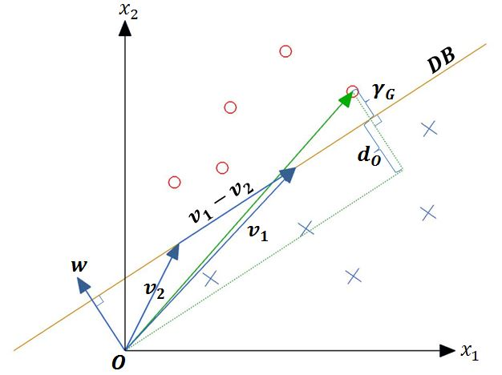

Machine Learning
======================================

Basic Concepts
--------------------------------------

**Hyperplane:** :math:`\lbrace \mathbf{x} : \mathbf{w}^T\mathbf{x}=b \rbrace`, :math:`\mathbf{w,x}\in \mathbb{R}^d`, :math:`b\in \mathbb{R}`. A set of points in :math:`\mathbb{R}^d` with a constant inner product to a given vector :math:`\textbf{w} \in \mathbb{R}^d`. The constant :math:`b` determines the offset of the hyperplane :math:`(\textbf{w},b)` from the origin. 

**Training Set** :math:`T` **:** The set of pairs :math:`(\mathbf{x}_t , y_t ) \subset \mathbb{R}^d \times \mathbb{R}` where the vectors :math:`\mathbf{x}_t` are samples  with known behaviour and :math:`y_t` are their labels. In classification, for each sample :math:`\mathbf{x}_t` in the training set, a label :math:`y_t` is assigned which classifies the sample in one of any given number of classes. In the notation :math:`\mathbf{x}_t`, :math:`t` belongs to the set :math:`\lbrace 1, 2, ..., l \rbrace` where :math:`l` is the total number of samples in the training set.

**Output Domain** :math:`Y` **:** For binary classification of the vectors in :math:`T`, the output domain is :math:`Y=\lbrace -1, 1  \rbrace`. A classifier function is developed based on the training set which assigns any new d-dimensional vector to one of the classes -1 and 1 correctly. In the ideal case the samples in the training set describe the general behavour of the vectors in the class sufficiently well so that the classifier function is able to classify any vector correctly, otherwise the classifier needs to be updated using new training samples. 

Linear Binary Classification
---------------------------------------

**Classification function:**  The classification function is defined as

.. math:: f(\mathbf{x}_t)= \left\{ \begin{array}{ll}
  1 & \mbox{ if $ \langle \mathbf{w}, \mathbf{x}_t \rangle +b > 0$}\\
   -1 & \mbox{else}
  \end{array}
  \right.
  :label: linClassF  

In Eq. :eq:`linClassF` :math:`\mathbf{w}` is the weight vector having the same dimension as the training sample vectors :math:`\mathbf{x}_t` and :math:`b` is the bias coefficient. The symbol :math:`\langle\cdot,\cdot\rangle` denotes the scalar product of two vectors.

The classifier function can be obtained using the perceptron algorithm.

**The Perceptron Algorithm:** A supervised learnign algorithm based on the gradual improvement of a classifier function until it classifies all the samples in the taining set correctly. The steps of the algorithm can be summarized as follows:
  
* Initialize: :math:`\mathbf{w}^{(0)}=\mathbf{0}`, :math:`b^{(0)}=0`, total number of updates=0, number of misclassifications in one pass=0, :math:`R=\max \Vert\mathbf{x}_t\Vert`
* for t=1 to number of samples: Check if :math:`y_t(\langle \mathbf{w}^{(k)}, \mathbf{x}_t \rangle + b^{(k)} )>0` is satisfied.
* If the above condition is not satisfied then do:

  - :math:`\mathbf{w}^{(k+1)}=\mathbf{w}^{(k)}+y_t\mathbf{x}_t`
  - :math:`b^{(k+1)}=b^{(k)}+y_tR^2` 

The perceptron algorithm uses a training set :math:`T=\lbrace(\mathbf{x}_t,y_t):\mathbf{x}_t\in\mathbb{R}^d, y_t\in\lbrace-1,1\rbrace\rbrace` of samples with known behaviour in order to obtain a proper weight vector and bias coefficient. The letter :math:`t` in the notation for a training sample :math:`\mathbf{x}_t` is the index of the training sample and belongs to the set :math:`\lbrace 1,...,l\rbrace` where :math:`l` is the total number of training samples. For each training sample :math:`\mathbf{x}_t` in the training set, a label :math:`y_t` is assigned according to the known behaviour of the sample.

The classifier function in Eq. :eq:`linClassF` makes a decision about the class of a vector :math:`\mathbf{x}_t` which depends on the expression :math:`\langle \mathbf{w}, \mathbf{x}_t\rangle+b` having a value greater than 0 or not. Therefore the set of vectors :math:`\mathbf{x}` in the :math:`\mathbb{R}^d` space for which
this expression is equal to 0 builds the decision boundary of the training set.

Formally the decision boundary is defined as :math:`DB =\lbrace \mathbf{x}\in\mathbb{R}^d:\langle\mathbf{w},\mathbf{x}\rangle+b = 0\rbrace`.The weight vector :math:`\mathbf{w}` determines the orientation of the decision boundary and is perpendicular to it. In order to show this, let :math:`\mathbf{v}_1` and :math:`\mathbf{v}_2` be any two vectors in :math:`DB`. Then :math:`\langle\mathbf{w},\mathbf{v}_1\rangle+b=\langle\mathbf{w},\mathbf{v}_2\rangle+b=0` and :math:`\langle\mathbf{w},\mathbf{v}_1-\mathbf{v}_2\rangle=0`. Therefore any vector lying within :math:`DB` is perpendicular to :math:`\mathbf{w}`. This can be easily visualized in :math:`\mathbb{R}^2`.

.. _DBR2:

In the above figure, the symbols 'x' and 'o' represent the samples of two different classes and :math:`\gamma_G` denotes the geometric margin of the decision boundary :math:`DB` between these two classes. The geometric margin is the smallest distance between any sample in the training set and the hyperplane that separates the two classes in the training set (the decision boundary). An expression to compute the magnitude of the geometric margin can be obtained as follow: Let :math:`\mathbf{x}_t` be the training sample having the least distance to the decision
boundary. Then, :math:`\mathbf{x}_t` can be expressed as the sum of its orthogonal projection on :math:`DB ((\mathbf{x}t)_\bot)` and another vector which is parallel to the weight vector :math:`\mathbf{w}`
as in Eq. :eq:`orthProj`

.. math:: \mathbf{x}_t= (\mathbf{x}_t)_{\bot}+(\gamma_G+d_O)\frac{\mathbf{w}}{\Vert\mathbf{w}\Vert}
  :label: orthProj

In Eq. :eq:`orthProj`, :math:`d_O` is the distance of the decision boundary from the origin and is
closely related to the bias coefficient b first introduced in Eq. :eq:`linClassF`. In order to
see that, let :math:`\mathbf{x}_0` be a vector that is perpendicular to the decision boundary
and has a magnitude equal to the distance of the decision boundary from the
origin such that :math:`\Vert \mathbf{x}_0 \Vert = d_O`. then :math:`\mathbf{x}_0` has the same direction as :math:`\mathbf{w}` and can be written as :math:`\mathbf{x}_0=\Vert\mathbf{x}_0\Vert\displaystyle\frac{\mathbf{w}}{\Vert\mathbf{w}\Vert}`. Clearly, :math:`\mathbf{x}_0` is also in the decision boundary and therefore :math:`\langle\mathbf{w},\mathbf{x}_0\rangle+b=\displaystyle\frac{\Vert\mathbf{x}_0\Vert}{\Vert\mathbf{w}\Vert}\langle \mathbf{w},\mathbf{w} \rangle + b=\Vert\mathbf{x}_0\Vert\Vert\mathbf{w}\Vert + b=0`. Therefore :math:`d_O` can be computed as in Eq. :eq:`dO`. 

.. math:: d_O=-\frac{b}{\Vert\mathbf{w}\Vert}
  :label: dO

Plugging the expression for :math:`d_O` from Eq. :eq:`dO` into Eq. :eq:`orthProj` and taking the scalar product of both sides of the equation with :math:`\mathbf{w}` we obtain Eq. :eq:`dOExpand`

.. math:: \langle\mathbf{w},\mathbf{x}_t\rangle=\langle\mathbf{w},(\mathbf{x}_t)_{\bot}\rangle+\frac{\gamma_G}{\Vert\mathbf{w}\Vert}\langle\mathbf{w},\mathbf{w}\rangle-\frac{b}{\Vert\mathbf{w}\Vert^2}\langle\mathbf{w},\mathbf{w}\rangle
  :label: dOExpand

Since :math:`\mathbf{w}` and :math:`(\mathbf{x}_t)_{\bot}` are perpendicular to each other, the :math:`\langle\mathbf{w},(\mathbf{x}_t)_{\bot}\rangle` term in Eq. :eq:`dOExpand` vanishes. After adding :math:`b` to both sides of Eq. :eq:`dOExpand`, we obtain Eq. :eq:`geomMargin` which shows the expression for the geometric margin :math:`\gamma_G` [3_].

.. math:: \langle\mathbf{w},\mathbf{x}_t\rangle+b=\gamma\Vert\mathbf{w}\Vert \Rightarrow \boxed{\gamma_G=\frac{\langle \mathbf{w},\mathbf{x}_t \rangle + b}{\Vert \mathbf{w} \Vert}}
  :label: geomMargin

The perceptron algorithm starts with the initialization of :math:`\mathbf{w}` and :math:`b` as
:math:`\mathbf{w}^{(0)} = \mathbf{0}`, :math:`b^{(0)} = 0`. In the next step the algorithm traverses the training set. For each pipe sample :math:`\mathbf{x}_t` in the training set, if the product y_t(\langle\mathbf{w}^{(k)}, \mathbf{x}_t\rangle+b^{(k)}) is less than or equal to zero, then this would imply that the actual label of the
training sample and the predicted label have opposite signs and the training sample is misclassified. In this case, :math:`\mathbf{w}^{(k)}` and :math:`b^{(k)}` are updated as follows:

.. math:: \mathbf{w}^{k+1}=\mathbf{w}^{k}+y_t\mathbf{x}_t
  :label: update1

.. math:: b^{(k+1)}=b^{(k)}+y_tR^2
  :label: update2

where :math:`R=\max\Vert\mathbf{x}_t\Vert`. It can be proven that the above updates improve the weight vector
and the bias coefficient as follows [1_]: Assume that after the updates, another attempt is made in order to classify the same training sample :math:`\mathbf{x}_t`. Then Eq. :eq:`getsBetter` shows that the new product :math:`y_t(\langle \mathbf{w}^{(k+1)},\mathbf{x}_t\rangle+b^{(k+1)})` is closer to a positive value compared to :math:`y_t(\langle \mathbf{w}^{(k)}, \mathbf{x}_t\rangle + b^{(k)})`.

.. math:: \begin{split}
  y_t( \langle \mathbf{w}^{(k+1)},\mathbf{x}_t \rangle+b^{(k+1)} ) &= y_t( \langle \mathbf{w}^{(k)}+y_t\mathbf{x}_t,\mathbf{x}_t \rangle+b^{(k)}+y_tR^2 )   \\
  &=y_t(\langle \mathbf{w}^{(k)}, \mathbf{x}_t  \rangle+y_t\Vert \mathbf{x}_t \Vert^2+b^{(k)}+y_tR^2) \\
  &=y_t(\langle \mathbf{w}^{(k)}, \mathbf{x}_t  \rangle +b^{(k)})+\Vert \mathbf{x}_t \Vert^2+R^2 \\
  &\geq y_t(\langle \mathbf{w}^{(k)}, \mathbf{x}_t \rangle+b^{(k)})
  \end{split}
  :label: getsBetter

It can also be proven that after a finite number of updates a proper classifier function can be obtained as long as the samples in the training set are linearly separable with a functional margin :math:`\gamma_F > 0`. The functional margin :math:`\gamma_t` of a training sample :math:`\mathbf{x}_t` with respect to a separating hyperplane (decision boundary) :math:`(\mathbf{w}, b)` is defined as [2_]:

.. math:: \gamma_t=y_t(\langle\mathbf{w},\mathbf{x}_t\rangle + b)
  :label: funcMargin

and the functional margin :math:`\gamma_F` of a separating hyperplane :math:`(\mathbf{w},b)` is defined as the minimum of all functional margins associated with a training set. A larger functinal margin implies that the training samples are geometrically farther away from the separating hyperplane and therefore the two classes are
more distinctly separated. The relationship between the functional margin and the geometric separateness of the classes can be reckoned by comparing the expressions for the geometric margin (Eq. :eq:`geomMargin`) and the functional margin (Eq. :eq:`funcMargin`).

In order to prove that the perceptron algorithm converges to a solution after a finite number of iterations, the following new weight vectors :math:`\mathbf{\widetilde{w}}` and training samples :math:`\mathbf{\widetilde{x}}_t` are defined by appending :math:`R` to every training sample and :math:`b^{(k)}/R` to every weight vector :math:`\mathbf{w}^{(k)}`:

.. math:: \mathbf{\widetilde{x}}_t=(\mathbf{x}_t^T,R),\quad \mathbf{\widetilde{w}}^{(k)}=({\mathbf{w}^{(k)}}^T,b^{(k)}/R)
  :label: appended

Given that the training samples are linearly separable, there exists a separating hyperplane :math:`( \mathbf{w}^{*},b^{*} )` such that for any :math:`(\mathbf{x}_t,y_t) \in T`, :math:`y_t(\langle \mathbf{w}^{*},\mathbf{x}_t\rangle+b^{*})=y_t\langle\widetilde{\mathbf{w}}^{*},\widetilde{\mathbf{x}}_t\rangle\geq \gamma^{*}` where :math:`\gamma^{*}` is the functional margin of :math:`( \mathbf{w}^{*},b^{*})`.

Assume that the weight vector :math:`\widetilde{\mathbf{w}}^{(k-1)}` resulted in a misclassification of the sample :math:`\widetilde{\mathbf{x}}_t` and is therefore updated to :math:`\widetilde{\mathbf{w}}^{(k)}`. :math:`\widetilde{\mathbf{w}}^{(k)}` and :math:`\widetilde{\mathbf{w}}^{*}` both belong to the vector space :math:`\mathbb{R}^3` and the cosine of the angle between them is defined as in Eq. :eq:`cosineOne`.

.. math:: \cos(\widetilde{\mathbf{w}}^{*}, \widetilde{\mathbf{w}}^{(k)})=\frac{\langle \widetilde{\mathbf{w}}^{*} , \widetilde{\mathbf{w}}^{(k)} \rangle}{\Vert \widetilde{\mathbf{w}}^{*}\Vert\Vert \widetilde{\mathbf{w}}^{(k)}\Vert}\leq 1
  :label: cosineOne

In Eq. :eq:`cosineOne`, the expression for :math:`\widetilde{\mathbf{w}}^{(k)}` can be expanded as follows.

.. math::
  \begin{split}
  \widetilde{\mathbf{w}}^{(k)}&=\Big({\mathbf{w}^{(k)}}^T, \frac{b^{(k)}}{R}\Big)=\Big({\mathbf{w}^{(k-1)}}^T+y_t\mathbf{x}_t^T,\frac{b^{(k-1)}+y_tR^2}{R}\Big)\\
  &=\Big({\mathbf{w}^{(k-1)}}^T+y_t\mathbf{x}_t^T, \frac{b^{(k-1)}}{R}+y_tR\Big) \\
  &=\widetilde{\mathbf{w}}^{(k-1)}+y_t\widetilde{\mathbf{x}}_t
  \end{split}

It can also be shown that the scalar product term in Eq. :eq:`cosineOne` is greater than or equal to :math:`k\gamma^*`. In order to show this let :math:`k=1`, then :math:`\langle \widetilde{\mathbf{w}}^*, \widetilde{\mathbf{w}}^{(1)}  \rangle=\langle \widetilde{\mathbf{w}}^*, \widetilde{\mathbf{w}}^{(0)}+y_t\widetilde{\mathbf{x}}_t  \rangle=y_t\langle \widetilde{\mathbf{w}}^*,\widetilde{\mathbf{x}}_t  \rangle\geq \gamma^*` since :math:`\widetilde{\mathbf{w}}^{(0)}` is initialized as the zero vector. If for some :math:`n\in\mathbb{N}`, :math:`\langle\widetilde{\mathbf{w}}^*,\widetilde{\mathbf{w}}^{(n)}\rangle\geq n\gamma^*`, then
:math:`\langle \widetilde{\mathbf{w}}^{*} , \widetilde{\mathbf{w}}^{(n+1)} \rangle=\langle \widetilde{\mathbf{w}}^*, \widetilde{\mathbf{w}}^{(n)}+y_t\widetilde{\mathbf{x}}_t  \rangle=y_t\langle \widetilde{\mathbf{w}}^*, \widetilde{\mathbf{x}}_t \rangle + \langle \widetilde{\mathbf{w}}^*, \widetilde{\mathbf{w}}^{(n)}  \rangle\geq\gamma^*+n\gamma^*=(n+1)\gamma^*`. By induction it follows that for any :math:`k\in\mathbb{N}`, :math:`\langle\widetilde{\mathbf{w}}^*, \widetilde{\mathbf{w}}^{(k)}\rangle\geq k\gamma^*`. Using this result the inequality in Eq. :eq:`ineq1st` is established.

.. math:: \frac{k\gamma^*}{\Vert\widetilde{\mathbf{w}}^* \Vert\Vert\widetilde{\mathbf{w}}^{(k)}\Vert}\leq 1
    :label: ineq1st

Furthermore, the boundedness of the norm :math:`\Vert \widetilde{\mathbf{w}}^{(k)}\Vert` can be shown as follows:

.. math::
  \begin{split}
  \Vert \widetilde{\mathbf{w}}^{(k)} \Vert^2&=\langle \widetilde{\mathbf{w}}^{(k-1)}+y_t\widetilde{\mathbf{x}}_t,\widetilde{\mathbf{w}}^{(k-1)}+y_t\widetilde{\mathbf{x}}_t  \rangle\\
  &=\Vert\widetilde{\mathbf{w}}^{(k-1)}\Vert^2+2y_t\langle\widetilde{\mathbf{w}}^{(k-1)}, \widetilde{\mathbf{x}}_t\rangle+\Vert\widetilde{\mathbf{x}}_t\Vert^2
  \end{split}

Since the weight vector :math:`\widetilde{\mathbf{w}}^{(k-1)}` resulted in a misclassification, it is known that :math:`y_t\langle \widetilde{\mathbf{w}}^{(k-1)},\widetilde{\mathbf{x}}_t \rangle\leq 0`. Therefore,

.. math::
  \Vert \widetilde{\mathbf{w}}^{(k)} \Vert^2\leq\Vert \widetilde{\mathbf{w}}^{(k-1)} \Vert^2+\Vert \widetilde{\mathbf{x}}_t \Vert^2

Using :math:`\Vert \widetilde{\mathbf{x}}_t \Vert^2=\Vert\mathbf{x}_t\Vert^2+R^2` yields

.. math:: \Vert\widetilde{\mathbf{w}}^{(k)}\Vert^2\leq\Vert \widetilde{\mathbf{w}}^{(k-1)} \Vert^2+2R^2
    :label: bounded1st

Eq. :eq:`bounded1st` implies the boundedness of :math:`\Vert\widetilde{\mathbf{w}}^{(k)}\Vert`. In order to prove this, consider that for :math:`k=1`, :math:`\Vert \widetilde{\mathbf{w}}^{(1)} \Vert^2\leq\Vert \widetilde{\mathbf{w}}^{(0)} \Vert^2+2R^2=2R^2=2kR^2`. If for some :math:`n\in \mathbb{N}`, :math:`\Vert\widetilde{\mathbf{w}}^{(n)}\Vert^2\leq 2 n  R^2` then using Eq. :eq:`bounded1st` we obtain :math:`\Vert\widetilde{\mathbf{w}}^{(n+1)}\Vert^2\leq\Vert\widetilde{\mathbf{w}}^{(n)}\Vert^2+2R^2\leq 2nR^2+2R^2=(n+1)2R^2`. By induction it follows that:

.. math:: \forall k\in\mathbb{N}, \Vert \widetilde{\mathbf{w}}^{(k)} \Vert^2\leq k2R^2
  :label: wkbound

By plugging Eq. :eq:`wkbound` in Eq. :eq:`ineq1st`, squaring both sides of the inequality and using the boundedness of :math:`\widetilde{\mathbf{w}}^*`, Eq. :eq:`proofComp` shows that only a finite number of iterations are needed in order to obtain a proper classifier function.

.. math:: \begin{split}
  \frac{k\gamma^*}{\Vert\widetilde{\mathbf{w}}^*\Vert R\sqrt{2k}}\leq 1 \Rightarrow \frac{k^2(\gamma^*)^2}{\Vert\widetilde{\mathbf{w}}^*\Vert^2 R^22k}\leq 1 \Rightarrow\boxed{ k\leq\frac{2R^2\Vert \widetilde{\mathbf{w}}^*\Vert^2}{(\gamma^*)^2}}
  \end{split}
  :label: proofComp

**References**

.. _1: 

Tommi Jaakkola, course materials for 6.867 Machine Learning, Fall 2006. MIT OpenCourseWare (http://ocw.mit.edu/), Massachusetts Institute of Technology. Downloaded on [26 May 2014].

.. _2:

Cristianini N., Shawe-Taylor John: An Introduction to Support Vector Machines and other Kernel Based Learning Methods, Cambridge University Press 2000

.. _3:

Bishop C.M. (2006); “Pattern Recognition and Machine Learning”, Springer; 1st ed., ISBN-10: 0-387-31073-8