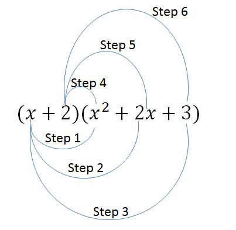

Pre-calculus
=================

Number sets
~~~~~~~~~~~~~~~~~~~~
* Real numbers :math:`\mathbb{R}`: This set contains all the numbers that we deal with in calculus except complex numbers.
* Natural numbers or positive integers :math:`\mathbb{N}`: This set consists of the integers :math:`\lbrace 1, 2, 3, ...\rbrace`
* Integers :math:`\mathbb{Z}`: :math:`\lbrace..., -3, -2, -1, 0, 1, 2, 3, ...\rbrace`.
* Rational numbers :math:`\mathbb{Q}`: These are the numbers that we obtain by dividing one integer by another integer. In other words, for every rational number :math:`q\in\mathbb{Q}`, there exist two integers :math:`p,r\in\mathbb{Z}, r\neq 0` such that :math:`q=p/r`.

Axioms of the set of real numbers :math:`\mathbb{R}`
~~~~~~~~~~~~~~~~~~~~~~~~~~~~~~~~~~~~~~~~~~~~~~~~~~~~~~~

* For any :math:`a,b\in\mathbb{R}`, :math:`a+b\in\mathbb{R}` and :math:`a\cdot b \in \mathbb{R}` (Closure law).
* For any :math:`a,b\in\mathbb{R}`, :math:`a+b=b+a` and :math:`a\cdot b=b\cdot a` (Commutative law).
* For any :math:`a,b,c\in\mathbb{R}`, :math:`(a+b)+c=a+(b+c)` and :math:`(a\cdot b)\cdot c=a\cdot (b\cdot c)` (Associative law).
* For any :math:`a,b,c\in\mathbb{R}`, :math:`a\cdot(b+c)=ab+ac` and :math:`(a+b)\cdot c=ac+bc` (Distributive law).

Factoring Polynomials
~~~~~~~~~~~~~~~~~~~~~~~~~~~~~~~~~~~~~~~~~~~~~~~~~~~~~~~

For any :math:`a,b,c,x\in\mathbb{R}`:

1. :math:`a^2-b^2=(a+b)(a-b)`
2. :math:`a^2 +2ab+b^2=(a+b)^2`
3. :math:`a^2 -2ab+b^2=(a-b)^2`
4. :math:`a^3+b^3=(a+b)(a^2-ab+b^2)`
5. :math:`a^3-b^3=(a-b)(a^2+ab+b^2)`
6. :math:`x^2+(a+b)x+ab=(x+a)(x+b)`
7. To factor :math:`ax^2+bx+c`, find two factors of :math:`ac` that add to :math:`b`. Let :math:`ac=f_1 f_2` such that :math:`f_1+f_2=b`. Then the polynomial can be written as :math:`ax^2+f_1x+f_2x+c`. Since :math:`a=f_1f_2/c`, the polynomial is equal to :math:`\displaystyle\frac{f_1f_2}{c}x^2+f_1x+f_2x+c`. Obviously, this is an expression with four components added together. The first two components have the common factor of :math:`f_1x`, therefore they can be combined to :math:`f_1x(\displaystyle\frac{f_2}{c}x+1)=\displaystyle\frac{1}{c}f_1x(f_2x+c)`. Here we see the addition of the third and fourth components as one of the factors of the addition of the first and second components. Therefore the whole polynomial can be factored as :math:`\displaystyle\frac{1}{c}(f_2x+c)(f_1x+1)`.  
8. To factor :math:`ax^2+bxy+cy^2`, find two factors of :math:`ac` that add to :math:`b`. Let :math:`ac=f_1 f_2` such that :math:`f_1+f_2=b`. Then the polynomial can be written as :math:`ax^2+f_1xy+f_2xy+cy^2`. Since :math:`a=f_1f_2/c`, the polynomial can be written as 

.. math::
	\frac{f_1f_2}{c}x^2+f_1xy+f_2xy+cy^2&=\frac{1}{c}(f_1f_2x^2+f_1cxy+f_2cxy+c^2y^2)\\
	&=\frac{f_1x}{c}(f_2x+cy)+\frac{1}{c}cy(f_2x+cy)\\
	&=\frac{1}{c}(f_2x+cy)(f_1x+cy) 

**Example 1** : Factor :math:`x^2+x-2`

**Solution**: This is a polynomial in the format :math:`ax^2+bx+c` where :math:`a=1`, :math:`b=1`, :math:`c=-2`. Therefore we can use the 7th rule of polynomial factorization. Since :math:`a\cdot c=-2=2\cdot (-1)` and :math:`2+(-1)=1=b`, we can write the polynomial as follows:

.. math::
	x^2+2x+(-1)x+(-1)(2)

The above expression has 4 components added to each other. Let's focus on the first two of these components. The reason for that is because the first two components :math:`x^2` and :math:`2x` have a common factor which is :math:`x`. So these two can be combined into a single term as :math:`x(x+2)`. The third and fourth components also have a common factor which is :math:`-1`. Therefore they can be combined into :math:`(-1)(x+2)`. So the whole polynomial becomes :math:`x(x+2)+(-1)(x+2)`. This last expression has only two components with the common factor :math:`(x+2)` added together. If we divide the first component by :math:`(x+2)` we obtain :math:`x` and if we divide the second component by :math:`(x+2)` we obtain :math:`(-1)`. Therefore this expression can be re-written as :math:`\boxed{(x+2)(x-1)}`. 

**Example 2** : Simplify the following rational expression

.. math::
	\frac{x^2-1}{x^2+x-2}

**Solution**: A rational expression is a fractional expression  in which both the numerator and the denominator are polynomials. In the above example the numerator is :math:`x^2-1` and the denominator is :math:`x^2+x-2`. Both of these expressions can be factored. First let's focus on the numerator: :math:`x^2-1=(x+1)(x-1)`. Now focus on the denominator: Using the result of Example 1 :math:`x^2+x-2=(x+2)(x-1)`. Now we can write the rational expression as follows:

.. math::
	\frac{x^2-1}{x^2+x-2}=\frac{(x+1)\color{red}{(x-1)}}{(x+2)\color{red}{(x-1)}}

The :math:`(x-1)` terms in the numerator and the denominator cancel each other. Therefore the expression can be simplified as :math:`\boxed{\displaystyle\frac{x+1}{x+2}}`

**Example 3** : Factor the polynomial :math:`3x^2+8xy+4y^2` 

**Solution**: Since :math:`3\cdot 4=12=6\cdot 2 \text{ and } 8=6+2`, we have 

.. math::
	3x^2+8xy+4y^2&=3x^2+6xy+2xy+4y^2\\
	   &=3x(x+2y)+2y(x+2y)\\
	   &=(3x+2y)(x+2y)

**Example 4**: Find the sum :math:`(x^3-6x^2+2x+4)+(x^3+5x^2-7x)`

**Solution**: We sum two polynomials by combining like terms. Like terms are terms with the same variable (x,y, etc.) raised to the same power. For example if one polynomial contains the term :math:`a\cdot x^2` and the other one contains :math:`b\cdot x^2`, then in the summation we would have :math:`(a+b)x^2`. In this example we have

.. math::
	(1+1)x^3+(-6+5)x^2+(2+(-7))x^1+(4+0)x^0=\boxed{2x^3+(-1)x^2+(-5)x+4}

**Example 5** : Factor the polynomial :math:`24x^2+19x+2` 

**Solution**: The polynomial has the format :math:`ax^2+bx+c` where :math:`a=24,\quad b=19,\quad c=2`. Using the 7th rule of polynomial factorization we obtain :math:`a\cdot c = 24\cdot 2=48`. Now we try to find two factors of 48 that add up to 19:

.. math::
	48&=1\cdot48,\quad 1+48=49\neq 19\\
	&=2\cdot24,\quad 2+24=26\neq 19\\
	&=3\cdot16,\quad 3+16=19

Therefore we should write the polynomial as :math:`24x^2+16x+3x+2`. Focusing on term 1 and term 2 we can see that they have :math:`8x` in common because :math:`24x^2=3\cdot 8\cdot x\cdot x` and :math:`16x=2\cdot 8\cdot x`. Now we can write the polynomial as :math:`8x(3x+2)+(3x+2)`. As the last step we divide both sides of the summation sign by :math:`(3x+2)` and write the polynomial as :math:`\boxed{(3x+2)(8x+1)}`.

**Example 6** : Multiply :math:`(x+2)(x^2+2x+3)`

**Solution**: Since :math:`x` is a variable that can have real number values, we can use the distributive law of the set of real numbers. We use the distributive law three times in this example. First we treat the second polynomial as a single real number. Call this number :math:`a`. Then the multiplication becomes :math:`(x+2)a=xa+2a=x(x^2+2x+3)+2(x^2+2x+3)` using the distributive law. Then we use the distributive law for the second time on :math:`xa` and for the third time on :math:`2a`. As a result we obtain :math:`x\cdot x^2+x\cdot 2x+x\cdot 3+2\cdot x^2+2\cdot 2x+2\cdot 3=\boxed{x^3+4x^2+7x+6}`. The term by term multiplication steps are illustrated in the following figure.

.. _preEx6:

    The steps of term by term multiplication of polynomials

.. container:: clearer

   .. image :: spacer.png

  
**References**

.. _1:

[1] Stewart J., Redlin L., Watson S.  ; “Precalculus - Mathematics for Calculus”, 7th edition,  ISBN: 978-1305071759 

.. _2:

[2] Safier F. ; "Schaum’s Outline of Theory and Problems of Precalculus", ISBN 0-07-05726 1-5