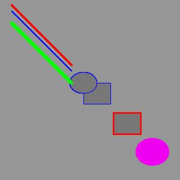

Processing
=================

List of Processing functions:
~~~~~~~~~~~~~~~~~~~~~~~~~~~~~~~~~~

* void **setup** (): The size of the drawing canvas and the backgroud colour are defined in this function. Every processing program starts with void setup().

* void **draw** (): All the drawing operations are done within this function. The code inside the draw() function is executed 60 times per second.

* **stroke(r,g,b)**: defines the colour of the lines following this function. r, g, b define the red, green and blue intensity. They take values between 0 and 255.

* **noStroke** (): Geometric shapes like rectangles and ellipses that follow this command are plotted without outer lines.

* **strokeWeight** (line thickness in pixels)

* **line** (x0,y0,x1,y1)

* **rect** (upperLeftX, upperLeftY, width, height)

* **ellipse** (centerX, centerY, width, height)

* **fill** (r,g,b): fills inside of rectangles and ellipses with colour.

**Example 1** : Drawing lines, rectangles and ellipses.

.. code-block:: c

	void setup(){
  		size(250,250);
  		background(150);
	}

	void draw(){
  		stroke(0,0,255);
  		strokeWeight(1);
  		line(20,20,120,120);
  		fill(120, 120, 120);
  		rect(140, 140, 45, 35);
  		ellipse(140, 140, 45, 35);
  		stroke(255,0,0);
  		strokeWeight(2);
  		line(20,10,120,110);
  		rect(190,190,45,35);
  		fill(240,0,240);
  		noStroke();
  		ellipse(255, 255, 55,45);
  		stroke(0,255,0);
  		strokeWeight(5);
  		line(20,40,120,140);
  	}

.. _35PercX65:

    The outcome of the code in Example 1

.. container:: clearer

   .. image :: spacer.png

The above example shows that once you define a line colour or filling colour, it affects every geometric shape that comes afterwards. This means, we don't need to re-define the line and filling colours unless we want to change them. Notice that as we change the line thickness with the strokeWeight() function, the outer line thicknesses of the rectangles and the ellipses also change. Also, using the noStroke() function we removed the outline of the last ellipse.