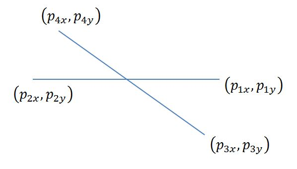

Polygon Meshing through Triangulation
===================================================

.. raw:: html

   <head>
      <meta charset="utf-8" />
      <title>Draw a blue rectangle (canvas version)</title>
   </head>
   <body onload="listen()">
      <canvas id="webgl" width ="650" height="650">
      Use html5 supporting browser
      </canvas>
      

          <button id="bDefine" type="button">BOUNDARY DEFINED</button>
          <button id="reDefine" type="button">REDEFINE BOUNDARY</button>
      

      How many interior points? <input type="text" id="iPoints">
      <button id="iPointsApply" type="button">Apply</button>
      <button id="meshBtn" type="button">Mesh</button>
      <button id="flipBtn" type="button">Flip</button>
      
      
      
      
      
      
   </body>
   </html>

The above canvas responds to mouse clicks by drawing a dot. Using mouse clicks the boundary of the domain to be meshed is defined. In the next step the interior of the boundary is populated with vertices with random position. In this process the random vertices are generated between the maximum and minimum x and y coordinates of the boundary vertices. In order to determine if a randomly generated vertex is inside the boundary or not, the following steps are applied [1_]:

- **Step 1**: For each newly generated interior vertex (test vertex), the y coordinate of this vertex is called the y-threshold. Find the edges constituting the boundary, which have one end above, the other end below the y-threshold. If one vertex of an edge is exactly on the y-threshold, then this vertex is assumed to be above the threshold. This is an arbitrary decision. If we choose the other way round it would work too as long as this rule is applied consistently.

- **Step 2**: Locate all points on the boundary where a straight horizontal line through the test vertex intersects the boundary. These are the points on the edges found in Step 1 having the same y-coordinate as the y-threshold. This can be done by interpolating between the two ends of the edge for the x coordinate that corresponds to the y-threshold. If the interpolated x-coordinate is less than the x-coordinate of the test vertex, then the intersection point is on the left hand side of the test vertex.

- **Step 3**: If both on the left and right hand side of the test vertex there are odd number of intersection points (like 3 and 3), then the test vertex is inside the polygon. If there are even number of intersection points on both sides, then it is outside the polygon.

Auxiliary Functions
~~~~~~~~~~~~~~~~~~~~~~~~~~~~~~~
**Finding if a point lies to the left or right of a line**:

**Finding the intersection point of two line segments**: We start this procedure by determining if two segments intersect or not. This can be done by checking the orientation of the segments with respect to each other [2_]. As an example the orientation of the segment :math:`(p_1, p_2)` in Figure 1 with respect to the vertex :math:`p_3` is counterclockwise and :math:`((p_2-p_1) \Lambda (p_3 - p_2))\cdot \mathbf{k}>0`. Similarly the orientation of the segment :math:`(p_1, p_2)` with respect to the vertex :math:`p_4` is clockwise and :math:`((p_2-p_1) \Lambda (p_4 - p_2))\cdot \mathbf{k}< 0`. Here the symbol :math:`\Lambda` denotes the cross product operation and :math:`\mathbf{k}` denotes a unit vector in the positive z-direction according to the right hand rule. 

.. _TwoSegs:

   Figure 1: Intersection of Segments

The necessary conditions for 2 segments oriented as in Figure 1, to intersect each other are:

**Condition1**: :math:`p_3` and :math:`p_4` must have opposite orientation with respect to the segment :math:`(p_1, p_2)`.

**Condition2**: :math:`p_1` and :math:`p_2` must have opposite orientation with respect to the segment :math:`(p_3, p_4)`.

**References**

.. _1: 

[1] http://alienryderflex.com/polygon/

.. _2: 

[2] http://www.geeksforgeeks.org/check-if-two-given-line-segments-intersect/
   
   